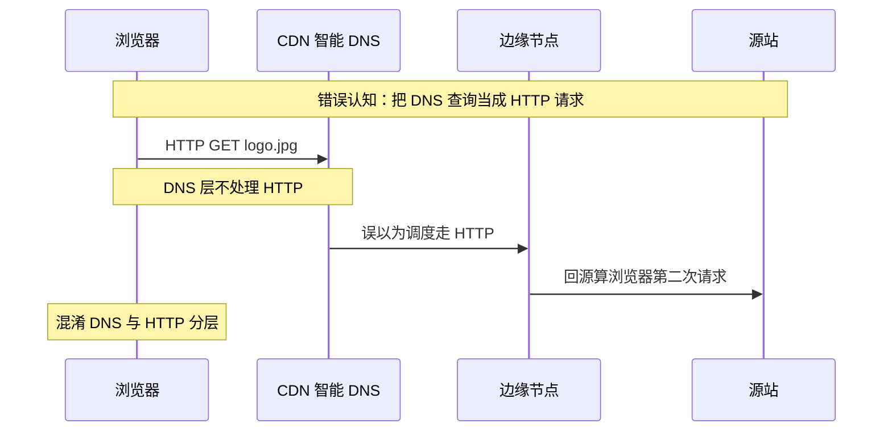
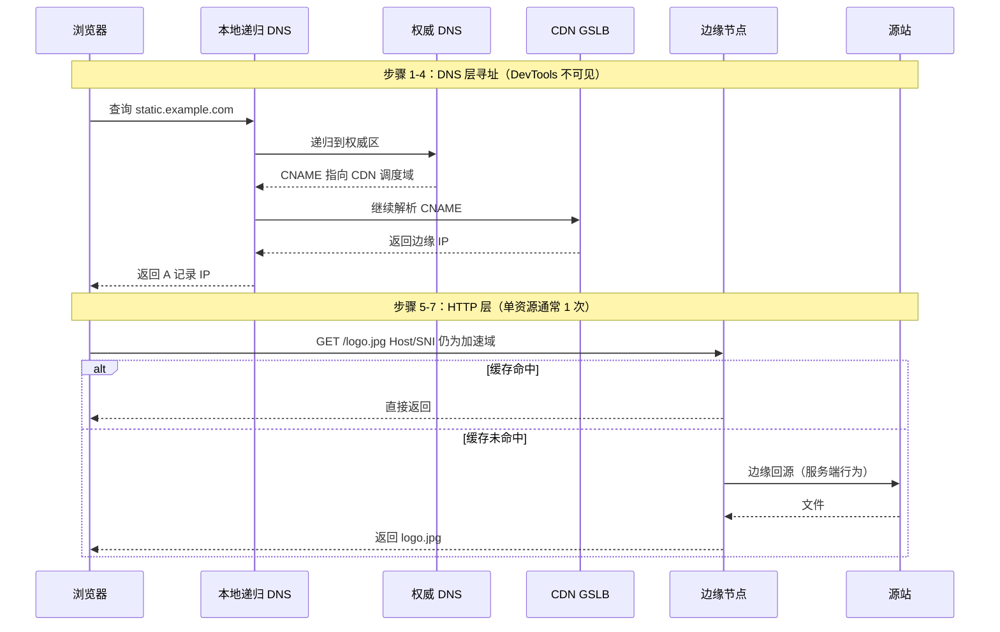
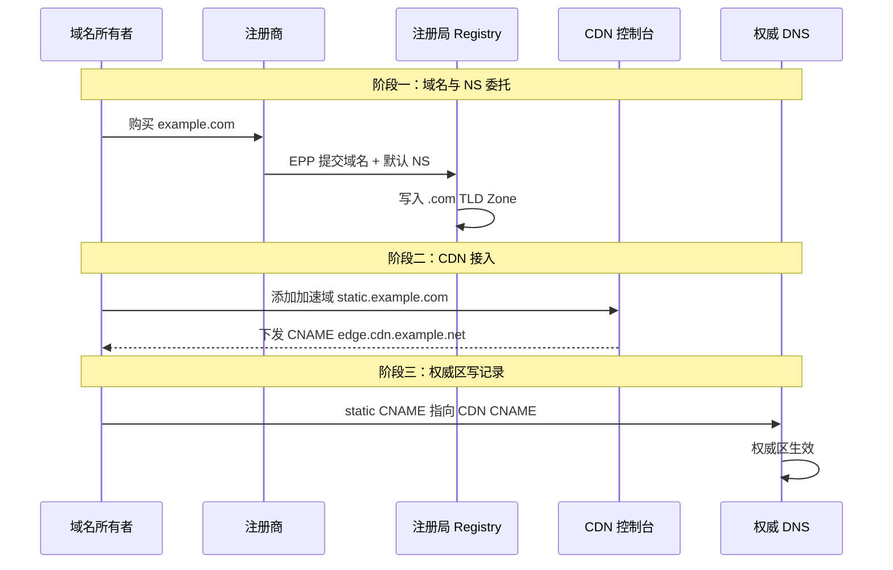

## 1. 案例概述

### 1.1 一句话概括

CDN 通过全球边缘节点就近缓存与回源，降低静态内容延迟并保护源站；DNS 的权威性来自注册局 Zone File 中的 NS 托管关系，业务侧用 CNAME 把加速域名导向 CDN 智能调度；域名年费本质是向注册局「租用」名称使用权，注册商代办并收取服务费。**单资源直链访问时，浏览器通常只发 1 次 HTTP 请求——但 DNS 递归与边缘回源都不算在这 1 次里。**

### 1.2 背景与目标

| 维度 | 说明 |
|------|------|
| 场景 | 静态资源加速、全球分发、突发流量缓冲、边缘安全防护 |
| 痛点 | CDN / DNS / 域名注册三层概念易混；「一次请求」「根数据库」等表述常被误读 |
| 目标 | 串起「买域名 → 写 CNAME → GSLB 算 IP → 边缘命中/回源」端到端链路 |
| 约束 | 动静分离优先；大陆加速需 ICP 备案；验收用 `dig`/`curl -I`，勿依赖 ping |

### 1.3 问题与修复对照

#### ❌ 常见误解：HTTP 请求先到 CDN 智能 DNS



#### ✅ 正确链路：DNS 调度在前，HTTP 传输在后



### 1.4 技术栈

| 层次 | 角色 / 技术 |
|------|-------------|
| 加速层 | CDN（边缘缓存 + GSLB 智能调度） |
| 解析层 | 权威 DNS（可与注册商分离） |
| 源站 | IP 或域名；Nginx 可做同域路径分流 |
| 域名治理 | 注册商 → 注册局（EPP）→ 顶级域 Zone |
| 协调机构 | ICANN（标识符协调与管理费） |
| 中国大陆合规 | ICP 备案（大陆加速区域必要） |

---

## 2. 适用场景与边界

| 场景 | 说明 |
|------|------|
| 静态资源加速 | 图片、CSS、JS、视频等用独立子域名走 CDN |
| 突发流量缓冲 | 大促 / 热点事件减轻源站带宽冲击 |
| 全球分发 | 海外用户低成本就近访问 |
| 边缘安全 | DDoS、WAF 等在边缘拦截 |
| 全站加速 | 动态路径强制不缓存，仅借 CDN 专线回源 |
| DNS 托管切换 | 注册商不变，仅改 NS 到其他权威 DNS |

**不适用 / 需谨慎**：

- **一刀切全域名上 CDN**：动态写操作、强一致会话需动静分离或「走 CDN 不缓存」
- **大陆加速但未备案**：大陆节点通常要求 ICP 备案
- **指望 CDN 永远更快**：首次访问、DNS 与建连在特定场景可能带来轻微额外延迟
- **把改 DNS 控制台理解成厂商越权**：本质是你先把权威托管给了对方

---

## 3. 端到端实现与技术细节

### 3.1 幕后准备三步骤

在用户访问 CDN 加速资源之前，须完成：

| 步骤 | 动作 | 结果 |
|------|------|------|
| **1. 购买域名** | 在注册商下单 `example.com`；经 EPP 向 `.com` 注册局提交 | 域名写入 **`.com` TLD Zone**；默认将注册商 DNS 登记为该域 **NS 委托** |
| **2. 接入 CDN** | CDN 控制台添加加速域 `static.example.com`，配置源站 | 平台分配专用 CNAME，如 `static.example.com.edge.cdn.example.net` |
| **3. 修改 DNS 解析** | 在权威 DNS 控制台为 `static.example.com` 添加 CNAME | 权威区数据更新；全球递归查询据此应答 |



### 3.2 用户访问七步链路

以深圳用户访问 `https://static.example.com/logo.jpg` 为例：

| 步骤 | 阶段 | 行为 |
|------|------|------|
| **1** | 浏览器发起 DNS | 查本地缓存无果 → 向本地递归 DNS 查询 |
| **2** | 全球递归查询 | 根 → `.com` TLD → 顶级域指引到 `example.com` 权威 NS |
| **3** | 权威 DNS 返回 CNAME | 返回 `static.example.com.edge.cdn.example.net`（**尚无 IP**） |
| **4** | CDN GSLB 调度 | 递归 DNS 继续解析 CNAME；按用户 IP、运营商、负载返回边缘 IP |
| **5** | 浏览器发起 HTTP(S) | 向边缘 IP 发起 **一次** HTTP 请求；**Host/SNI 仍为 `static.example.com`** |
| **6** | 边缘处理 | 命中直接返；未命中则边缘作反向代理回源并缓存 |
| **7** | 数据返回 | 边缘将响应体传回浏览器 |

**关键分界**：

- 步骤 1–4 为 **DNS 层寻址**，不计入 DevTools HTTP 请求数
- 步骤 5–7 为 **HTTP 传输**；单资源直链、无跳转、无 CORS 预检时 **仅 1 次** HTTP
- 边缘回源是 **CDN→源站** 的服务端行为，**不算**浏览器额外请求
- GSLB 调度发生在 DNS 阶段；DNS 结果会被 TTL 缓存

### 3.3 易误解表述勘误

| 易误解表述 | 准确边界 |
|------------|----------|
| 「浏览器全程只发一次请求」 | **仅指单个资源**；整页含 HTML/CSS/JS/多图时为多次 HTTP |
| 「请求先到 CDN 智能 DNS」 | 指 **DNS 查询**先到调度体系，不是 HTTP 请求 |
| 「域名写入全球根库」 | 应理解为写入 **TLD Zone**；根服务器不存具体二级域记录 |
| 「ping 验证 CDN 生效」 | **不可靠**；应用 `dig`/`nslookup`/`curl -I` |
| 「权威 DNS 直接连 GSLB」 | 权威返回 CNAME → **递归解析器**再向 CDN 权威区查询 |
| 「大陆加速只要域名备案」 | 通常还需 **CDN 接入备案** |

### 3.4 流量切割三种模型

| 方案 | 做法 | DNS 落点 | 特点 |
|------|------|----------|------|
| **一、动静分离（主流）** | `www`/`api` → A/源站；`static` → CNAME→CDN | 分流在 DNS 第一关 | 标准、清晰 |
| **二、同域路径分流** | 同域 A 到源站；Nginx 对 `/static/*` 反代到 CDN | DNS 仍指源站 | 源站仍收首跳，减负不彻底 |
| **三、全站加速** | 主域也指 CDN；静态缓存、动态强制不缓存 | 全量经边缘 | 「走 CDN」≠「被缓存」 |

**架构铁律**：生产环境并非所有请求都走 CDN；规划加速域名 → 改静态引用 → **仅**加速子域名 CNAME → 主域保留直连源站。

### 3.5 DNS 权威与 Registry 分层

**递归解析路径**：

1. 本地缓存 / hosts
2. 本地 DNS → 根 → 顶级域
3. 顶级域返回该域的 **权威 NS**
4. 权威 DNS 给出 A/CNAME 等最终答案

**谁能改你的 DNS 记录**：因为你把该域的权威托管给了它——注册时默认 NS，或从注册商处改 NS 指向其他权威 DNS 服务器。这是**授权托管**，不是厂商随意越权。

| 角色 | 职责 |
|------|------|
| **注册局 Registry** | 某 TLD 最高管理机构；**唯有它**可改顶级域 Zone |
| **注册商 Registrar** | 获授权面向用户售卖；通过 **EPP** 向注册局提交指令 |

**注册瞬间**：下单 → 注册商生成含域名与默认 NS 的指令 → EPP 提交注册局 → 校验未占用 → **写入 TLD Zone File**。

**改权威 DNS**：在注册商改 NS → API 通知注册局 → Zone 更新 → 全球缓存（常 **24–48 小时**）过期后一致。

### 3.6 域名费用归属（教学估算）

以约 **65 元人民币**注册普通 `.com` 为例（**非实时牌价**）：

| 去向 | 量级 | 说明 |
|------|------|------|
| 注册局批发价 | 约 55–60 元 | 刚性成本，全球统一量级 |
| ICANN | 约 0.18 美元 | 注册/续费「管理税」 |
| 注册商差价 | 剩余数元 | 客服、控制台、支付与 DNS 等服务利润 |

结论：付费是向注册局租用名称权；注册商是代收代付与服务中介；首年低价、续费升高是常见商业策略。

### 3.7 关键配置示意

```yaml
# 逻辑配置示意（非某一厂商专用）
cdn:
  accelerate_domain: static.example.com
  region: mainland_china   # 或 global / overseas；大陆需 ICP
  origin:
    address: "origin.example.com 或源站 IP"
    protocol: https
  cache:
    rules:
      - match: "*.jpg|*.css|*.js"
        ttl: "按业务设定"
  tls:
    enabled: true
  warmup:
    enabled: true

dns:
  records:
    - host: www
      type: A
      value: "<源站或 LB IP>"
    - host: api
      type: A
      value: "<源站或 LB IP>"
    - host: static
      type: CNAME
      value: "<厂商下发的 *.cdn... CNAME>"
```

**运维顺序建议**：

1. 源站与备案就绪 → 开通 CDN 并添加加速域
2. 应用静态 URL 切到加速域（动静分离）
3. 再改 DNS CNAME，避免不一致窗口
4. 用 `dig`/`curl -I` 确认解析落点
5. 改 NS 时预留最长约 48 小时缓存收敛窗口

---

## 4. 关键设计选择及原因

### 4.1 边缘缓存 + 回源，而非全员直连源站

| 原因 | 说明 |
|------|------|
| 物理距离 | 就近节点降低 RTT |
| 源站减负 | 命中后不再打满源站带宽 |
| 冗余切换 | 多节点故障可调度 |

**备选**：全球用户全部直连源站 → **放弃原因**：跨国延迟高、突发易打挂源站。

### 4.2 独立静态子域名 CNAME 上 CDN（动静分离）

| 原因 | 说明 |
|------|------|
| DNS 级切割 | 主域根本不进 CDN，架构清晰 |
| 缓存语义 | 静态可长 TTL，动态不被误缓存 |
| 行业惯例 | 最主流标准做法 |

**备选**：所有域名都指 CDN；或同域 Nginx 反代 → **放弃为默认首选**：全量进 CDN 扩大故障面；同域反代减负不彻底。

### 4.3 切流用 CNAME，而非固定 CDN 节点 IP

| 原因 | 说明 |
|------|------|
| 调度弹性 | CNAME 落到 CDN 智能调度，可换节点 |
| 运维简单 | 厂商变更底层 IP，业务 DNS 记录可保持 |

**备选**：业务侧直接 A 记录到某边缘 IP → **放弃原因**：无法享受 GSLB，节点变更需反复改 DNS。

### 4.4 在 DNS 阶段完成 GSLB，而非浏览器 HTTP 试探

| 原因 | 说明 |
|------|------|
| 透明调度 | 递归解析 CNAME 链时 GSLB 按解析器视角返回边缘 A |
| 单资源单次 HTTP | 直链访问单个静态资源通常只 1 次 HTTP |
| 观测边界 | DevTools 只统计 HTTP；DNS 递归不可见 |

**备选**：浏览器先请求调度 API 再拉资源 → **放弃原因**：多一次 HTTP、与主流 CNAME+GSLB 模式不符。

### 4.5 权威 DNS 可与注册商分离

| 原因 | 说明 |
|------|------|
| 能力分层 | 注册商管生命周期；权威 DNS 管记录与解析性能 |
| 可迁移 | 改 NS 经注册局更新即可换 DNS 服务商 |

**备选**：永远只用注册商默认 DNS → **并非错误**，但放弃解耦灵活性。

---

## 5. 风险与应对

| 风险 | 应对 |
|------|------|
| CDN 厂商故障或被屏蔽 | 预案含临时改回源站 A/备用厂商、降级直连 |
| 边缘被投毒/篡改静态资源 | SRI、HTTPS、权限与回源校验 |
| 全量域名误上 CDN | 动静分离；动态路径强制不缓存 |
| DNS 变更全球未收敛 | 改 NS 预留约 24–48h；改 CNAME 约 10min～数小时 |
| 大陆未备案上大陆节点 | 先备案或改境外/全球策略 |
| 缓存导致内容过旧 | 合理 TTL、版本化文件名、定向刷新/预热 |
| HTTPS 证书与 SNI 不匹配 | 加速域必须配置对应证书；Host/SNI 须一致 |
| 误解「注册商可改全球 DNS」 | 培训：权威托管 vs 注册局写 TLD Zone |

---

## 6. 测试要点

| 优先级 | 用例 |
|--------|------|
| P0 | 加速域 CNAME 生效后，解析落点为 CDN 而非源站 IP |
| P0 | 缓存未命中回源成功；命中后源站流量明显减少 |
| P0 | 主域/API 域仍直连源站（动静分离） |
| P0 | 全站加速下 `/api/*` 不被错误缓存 |
| P0 | 单静态资源直链：DevTools 对该资源仅 1 条 HTTP |
| P0 | `dig static.example.com` 解析链含 CNAME→CDN，最终 A 非源站 IP |
| P1 | HTTPS 证书在加速域正确；回源协议符合预期 |
| P1 | 大陆区域与备案状态匹配 |
| P2 | 改 NS 后递归解析切到新权威 |
| P2 | 模拟 CDN 不可用时的回切/降级演练 |

---

## 7. 深度剖析：常见面试问答

### Q1：CDN 解决的本质问题是什么？和「源站加机器」有何不同？

CDN 本质是全球边缘缓存与调度网络，让用户就近取内容并降低源站带宽冲击。单纯源站加机器仍可能跨地域延迟高、出口带宽贵；CDN 把「读多写少」的内容副本推到边缘。源文量级参考：加载速度约提升 30%–70%，源站带宽可降 70% 以上（落地需自测）。

### Q2：为什么说「某个域名一旦 CNAME 到 CDN，该域上的请求都会先经 CDN」？

DNS 解析对该加速域名返回 CDN 调度相关结果，浏览器连接的是边缘而非源站 IP。「是否走 CDN」首先由**用哪个域名请求**决定。要对部分流量禁用 CDN，必须用其他域名直连，或同域但 DNS 仍指源站再由本机分流。

### Q3：动静分离为什么优先「不同子域名」而不是「同路径反代」？

子域名方案：静态 `static.` CNAME→CDN，动态 `www`/`api` A→源站，DNS 即第一道关，源站零感知静态洪峰。同域 Nginx 反代：DNS 仍指源站，源站仍承载首跳，减负不彻底。同域方案适用于必须共用 Cookie/域名等约束。

### Q4：全站加速模式下，「流量经过 CDN」和「内容被 CDN 缓存」有何区别？

主域 DNS 可指向 CDN，所有请求进边缘。静态后缀可缓存命中；`/api/*` 等可配置强制不缓存，边缘只做专线回源加速通道。面试易错点：以为「进了 CDN」就一定「被缓存」。

### Q5：从用户输入 URL 到拿到图片，完整七步分别发生什么？

- **步骤 1–2**：浏览器 → 本地递归 DNS → 根 → `.com` TLD → 得知权威 NS
- **步骤 3**：权威 DNS 返回 **CNAME**（尚无 IP）
- **步骤 4**：递归继续解析，**GSLB** 按用户 IP/运营商/负载返回边缘 IP
- **步骤 5–7**：浏览器发 **1 次** HTTP(S) 到边缘 IP，**Host/SNI 仍为加速域**；边缘命中直接返，未命中则服务端回源后返
- DevTools 只见步骤 5 起的 HTTP；整页场景下 static 域资源各有独立 HTTP 次数

### Q6：为什么在权威 DNS 控制台改 CNAME 就能全球生效？是厂商「有权改全世界 DNS」吗？

能改是因为该域的**权威 DNS**托管在对方：注册默认 NS，或你把 NS 改成其服务器。全球递归最终问到权威区，读到你写入的 CNAME。性质是授权托管，不是无授权篡改任意域名。

### Q7：修改 NS 后为何常提示「48 小时生效」？注册局很慢吗？

注册局更新 Zone 可近乎即时；慢的是全球递归侧对旧 NS 委托结果的缓存。运维上应在低峰改 NS，并预留验证观察期。

### Q8：为什么说「浏览器只发一次请求」？DNS 查询算不算？

- **DNS（步骤 1–4）**：操作系统/递归 DNS 完成，**不计入** DevTools HTTP 请求数
- **单资源场景**：直链访问 `logo.jpg` 且无重定向/预检时，对该资源 **1 次** HTTP；边缘回源是服务端行为
- **整页场景**：HTML + 多个 static 资源 = **多次** HTTP
- **HTTPS**：连的是边缘 IP，但 **SNI/Host** 必须是加速域名

---

## 8. 团队规范沉淀

1. **动静分离默认**：仅 `static.` 等加速子域名 CNAME 上 CDN，主域/API 保留 A 记录直连源站
2. **分清三层**：DNS 调度 ≠ HTTP 传输 ≠ 边缘回源；排障时 `dig` 看 DNS，Network 看 HTTP
3. **表述严谨**：「一次 HTTP」指单资源直链；整页多次；HTTPS 仍需 Host/SNI
4. **验收工具**：`dig` + `curl -I`，慎用 ping（多数 CDN 不响应 ICMP）
5. **变更窗口**：改 NS 预留 24–48h；改 CNAME 约 10min～数小时；先改应用 URL 再切 DNS

---

## 9. 小结

> **CDN 是就近缓存，DNS 决定流量入口，Registry 决定权威委托从何而来；GSLB 在 DNS 阶段完成调度，浏览器对单个静态资源通常只发 1 次 HTTP——但别把 DNS 递归、边缘回源和整页多资源混为一谈。**

工程落地记住五件事：动静分离切流、CNAME 而非固定边缘 IP、权威托管不等于越权、大陆加速先备案、验收用 `dig`/`curl -I` 而非 ping。把「买域名 → 写 CNAME → GSLB 算 IP → 边缘命中/回源」这条链想清楚，CDN 接入就不再是黑盒配置。
