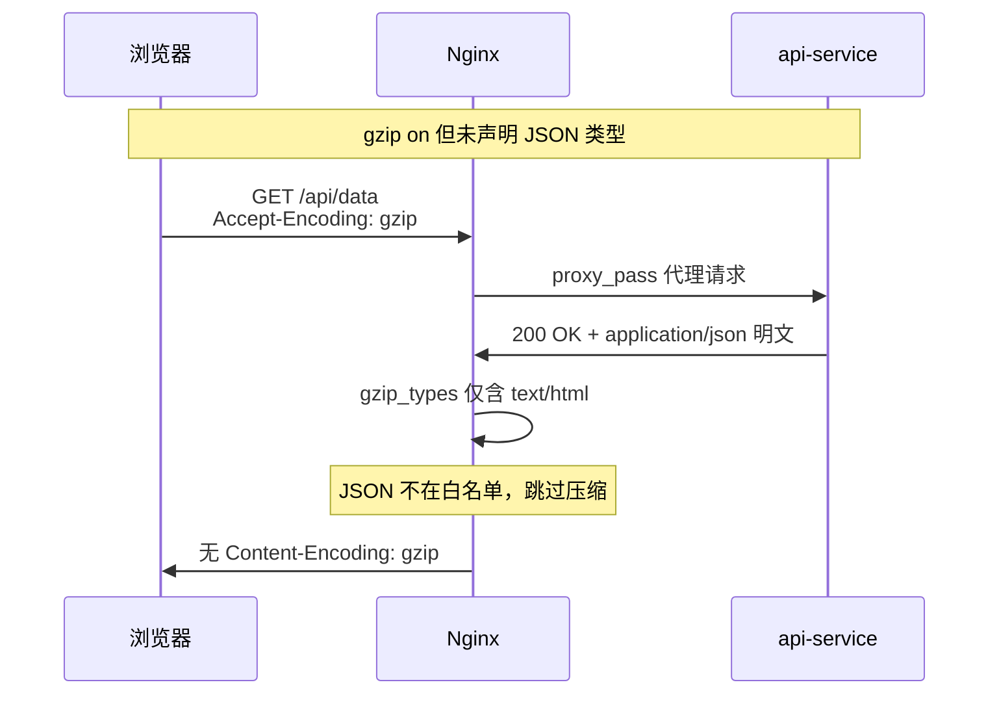
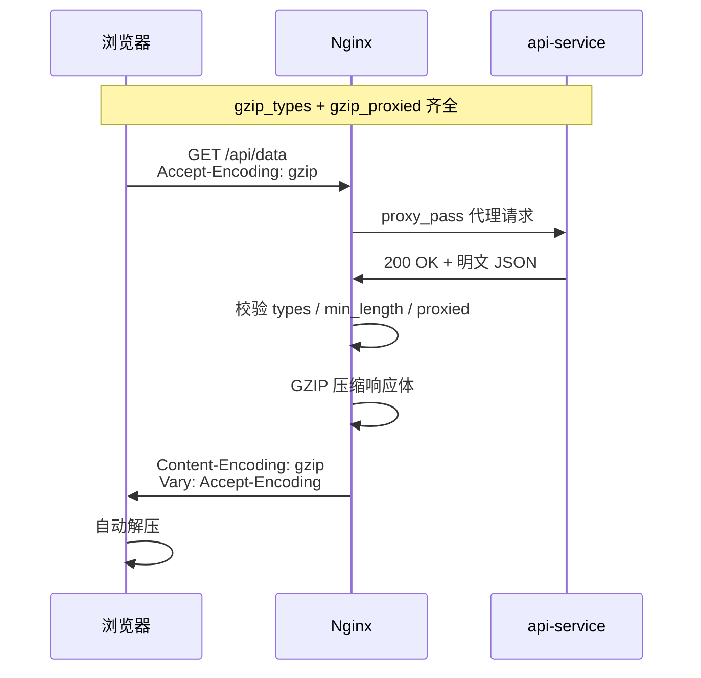
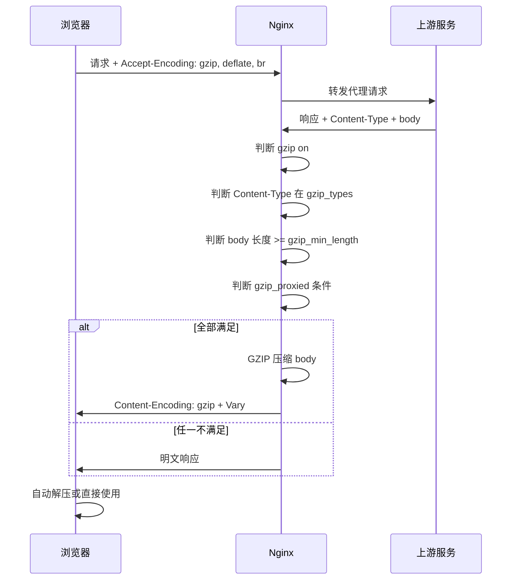
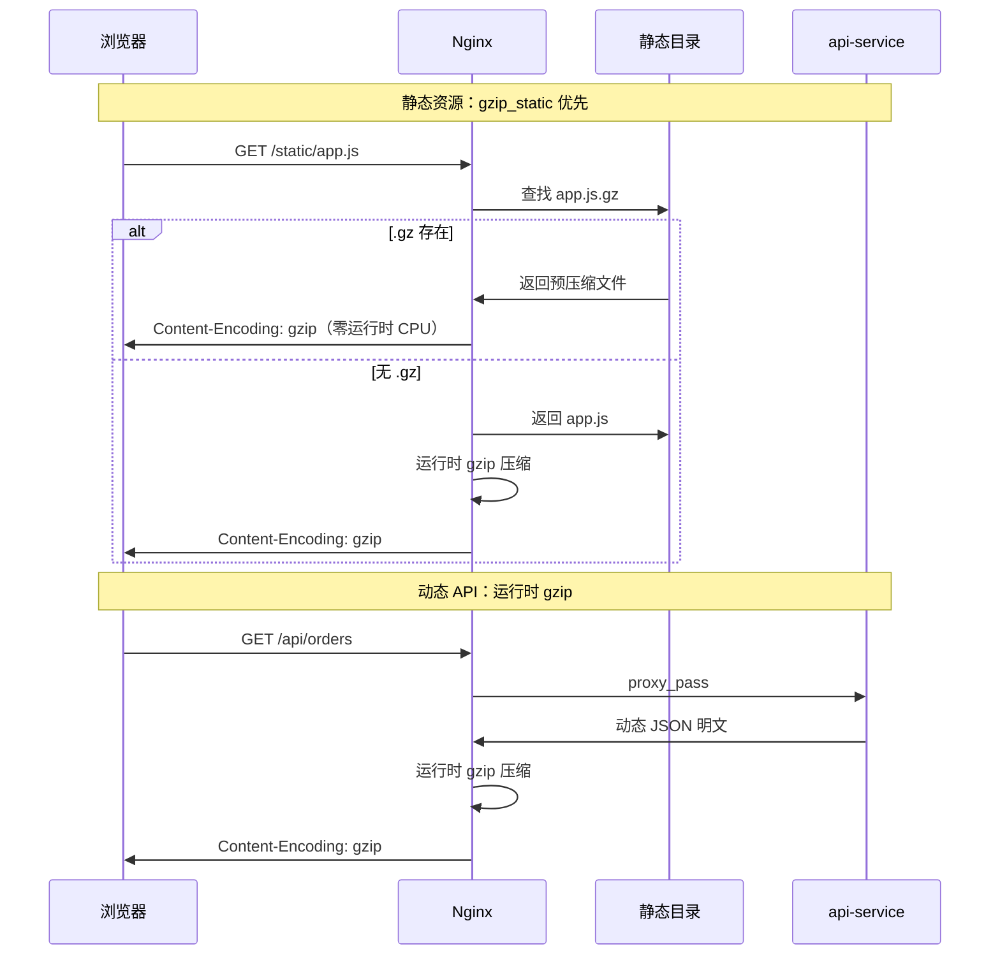

## 1. 案例概述

### 1.1 一句话概括

在 Nginx 作为反向代理或静态资源网关时，通过 HTTP 响应体 GZIP 压缩，在边缘层将 HTML/CSS/JS/JSON 等文本资源压缩后再传输，可显著降低带宽占用、加快页面与 API 加载；关键是**显式声明 JSON 类型**、**代理场景开启 `gzip_proxied`**、**有 CDN 时开启 `gzip_vary`**，三者缺一，很容易出现「gzip 已开但 JSON 仍不压缩」的假象。

### 1.2 背景与目标

| 维度 | 说明 |
|------|------|
| 场景 | Nginx 统一代理 `/web/` 前端静态资源与 `/api/` 后端接口 |
| 痛点 | 弱网环境下 JSON 响应体积大，首屏与接口加载慢 |
| 目标 | 在网关层零侵入压缩，上游应用仍返回明文，浏览器自动协商解压 |
| 约束 | 不改造业务代码，不引入额外 Nginx 模块，配置可热加载 |

### 1.3 问题与修复对照

#### 常见误配：gzip on 但 JSON 不压缩



#### 正确配置：边缘统一压缩



### 1.4 技术栈

| 层次 | 技术 |
|------|------|
| 网关 / 反向代理 | Nginx（内置 gzip 模块） |
| 可选增强 | `gzip_static`（预压缩 .gz 文件） |
| 可选替代 | Brotli（需 `ngx_brotli` 模块，当前未启用） |
| 客户端 | 浏览器 `Accept-Encoding` 协商 |

---

## 2. 故障现象与根因

### 2.1 典型现象

运维同学反馈：「`http` 块已经 `gzip on`，但 API 响应没有 `Content-Encoding: gzip`。」用 curl 验证：

```bash
# 现象：响应头无 Content-Encoding
curl -H "Accept-Encoding: gzip" -I http://localhost/api/health
```

浏览器 DevTools Network 面板中，JSON 接口的「传输大小」与「实际大小」几乎相同，说明压缩未生效。

### 2.2 错误配置特征

```nginx
# ❌ 仅开启总开关，代理 JSON 基本无效
http {
    gzip on;
    # 缺少 gzip_types application/json
    # 缺少 gzip_proxied
}
```

```nginx
# ❌ 声明了 JSON 类型，但代理场景未开启 proxied
http {
    gzip on;
    gzip_types application/json;
    # gzip_proxied 默认 off，上游响应不压缩
}
```

### 2.3 根因链

| 步骤 | 现象 | 根因 |
|------|------|------|
| 1 | `gzip on` 已配置 | 仅打开总开关，不等于所有类型都压缩 |
| 2 | JSON 响应无压缩 | 默认 `gzip_types` 仅含 `text/html`，`application/json` 不在白名单 |
| 3 | 代理响应仍不压 | `gzip_proxied` 默认 `off`，`proxy_pass` 回来的响应不满足压缩条件 |
| 4 | CDN 偶发乱码 | 未设 `gzip_vary on`，共享缓存可能把 gzip 版发给不支持 gzip 的客户端 |

### 2.4 次要问题

| 问题 | 影响 |
|------|------|
| 未设 `gzip_min_length` | 极小响应加 GZIP 头后可能比原文更大，浪费 CPU |
| 对已压缩格式再 gzip | JPEG/woff2 等几乎无收益，徒增 CPU |
| 上游已返回 `Content-Encoding: gzip` | 双重压缩或策略混乱，排查困难 |

---

## 3. 修复方案

### 3.1 目标结构

```
http 块（全局生效）
├── gzip on                    # 总开关
├── gzip_vary on               # CDN 安全
├── gzip_proxied any           # 代理响应压缩
├── gzip_comp_level 6          # 性价比级别
├── gzip_min_length 1000       # 过滤极小响应（建议）
├── gzip_types ...             # MIME 白名单（含 JSON）
└── include conf.d/*.conf
    ├── server /web/           # 静态资源
    ├── server /api/           # 反向代理 API
    └── location /static/      # 可选 gzip_static
```

### 3.2 推荐生产配置

```nginx
# ✅ 网关层统一压缩
http {
    gzip on;
    gzip_vary on;
    gzip_proxied any;
    gzip_comp_level 6;
    gzip_min_length 1000;
    gzip_types
        text/plain text/css text/xml text/javascript
        application/json application/javascript
        application/xml application/xml+rss
        application/atom+xml
        image/svg+xml;

    include /etc/nginx/conf.d/*.conf;
}

# 静态资源目录可选：构建期预压缩
location /static/ {
    gzip_static on;   # 若构建阶段产出 .gz 文件
    expires 7d;
}
```

### 3.3 压缩协商时序



### 3.4 静态资源 vs 动态 API 路径对比



### 3.5 核心指令说明

| 指令 | 默认值 | 推荐配置 | 作用 |
|------|--------|----------|------|
| `gzip on` | off | on | 总开关 |
| `gzip_comp_level` | 1 | 6 | 压缩级别 1–9，6 为性价比平衡点 |
| `gzip_types` | text/html | 见上 | MIME 白名单，**必须含 application/json** |
| `gzip_min_length` | 20 | 1000 | 小于此字节数不压缩 |
| `gzip_vary` | off | on | 添加 `Vary: Accept-Encoding`，CDN 必备 |
| `gzip_proxied` | off | any | 代理响应是否压缩，**反向代理必开** |
| `gzip_static` | off | 静态目录按需 | 直接发送预压缩 .gz 文件 |

### 3.6 典型压缩收益（经验值）

| 资源类型 | 压缩前 | 压缩后（约） | 节省 |
|---------|--------|-------------|------|
| HTML | 50KB | 10KB | ~80% |
| CSS | 100KB | 20KB | ~80% |
| JSON API | 20KB | 3KB | ~85% |
| JS | 200KB | 60KB | ~70% |

---

## 4. 关键设计选择及原因

### 4.1 在 Nginx 压缩 vs 在应用层压缩

| 原因 | 说明 |
|------|------|
| 统一入口 | 所有经 Nginx 的流量一处配置，无需每个服务重复实现 |
| 解耦业务 | 上游仍返回明文，降低应用复杂度 |
| 静态 + 动态兼顾 | 同一套 gzip 规则覆盖 proxy 与 `alias` 静态目录 |

**备选方案**：应用内 gzip（Spring `server.compression`、PHP `ob_gzhandler`）→ **放弃原因**：多服务重复配置、静态资源与 API 策略难统一。

### 4.2 `gzip_comp_level 6` vs 更高/更低级别

| 原因 | 说明 |
|------|------|
| 性价比 | level 6 与 9 体积差距小，CPU 开销明显更低 |
| 高 QPS 友好 | API 网关场景 CPU 常为瓶颈 |

**备选方案**：level 9 → **放弃原因**：CPU 激增，收益边际递减；level 1–3 → **放弃原因**：压缩率不足。

### 4.3 显式声明 `gzip_types`（含 application/json）

| 原因 | 说明 |
|------|------|
| 默认仅 html | Nginx 默认只压 `text/html`，不声明则 JSON API 不压缩 |
| API 体积大 | JSON 文本可压缩性高，是主要收益来源 |

**备选方案**：依赖默认类型 → **放弃原因**：反向代理 JSON 基本无效。

### 4.4 `gzip_proxied any`

| 原因 | 说明 |
|------|------|
| 代理为主 | Nginx 主要 `proxy_pass` 到后端服务 |
| 默认 off | 不配置则上游响应不满足 proxied 条件时不压缩 |

**备选方案**：`gzip_proxied expired no-cache` 等细粒度 → **放弃原因**：API 响应 Cache-Control 多样，易漏压。

### 4.5 `gzip_vary on`

| 原因 | 说明 |
|------|------|
| CDN 安全 | 防止共享缓存把 gzip 版发给不支持 gzip 的客户端 |
| 多表示协商 | 同一 URL 可能存在压缩/非压缩两种表示 |

**备选方案**：关闭 vary → **放弃原因**：有 CDN 时存在缓存污染风险。

### 4.6 运行时 gzip vs `gzip_static` 预压缩

| 原因 | 说明 |
|------|------|
| 配置简单 | 当前仅运行时压缩，无需改造构建流水线 |
| 静态场景 | `/static/` 长缓存资源适合构建期生成 .gz |

**备选方案**：全量 `gzip_static` → **放弃原因**：动态 API 无法预压缩。两者可组合。

### 4.7 GZIP vs Brotli

| 原因 | 说明 |
|------|------|
| 内置支持 | GZIP 为 Nginx 标配，无额外模块 |
| 兼容性 | 所有现代浏览器均支持 |

**备选方案**：Brotli → **放弃原因**（当前）：需编译/安装模块，运维成本高；可作为后续优化。

---

## 5. 风险与应对

| 风险 | 应对 |
|------|------|
| JSON 未压缩 | 检查 `gzip_types` 是否含 `application/json`、`gzip_proxied` |
| CDN 缓存错乱 | 开启 `gzip_vary on` |
| CPU 飙升 | 降低 `gzip_comp_level` 至 4；静态改 `gzip_static` |
| 压缩后体积更大 | 设置 `gzip_min_length`；勿将图片等加入 `gzip_types` |
| 上游已压缩二次处理 | 上游勿重复 gzip；Nginx 识别已有 `Content-Encoding` |
| location 误关 gzip | 检查子块是否 `gzip off` |
| HTTPS/HTTP2 | GZIP 仍有效；HPACK 仅压头部，body 仍靠 GZIP |

---

## 6. 测试要点

| 优先级 | 用例 |
|--------|------|
| P0 | `/api/` JSON 接口：带 `Accept-Encoding: gzip` 返回 `Content-Encoding: gzip` |
| P0 | 不带 `Accept-Encoding` 时返回明文，body 可正常解析 |
| P0 | `/web/` 前端 HTML/JS 资源压缩生效 |
| P1 | 响应 < 1KB 时行为符合 `gzip_min_length` 预期 |
| P1 | `gzip_vary` 存在时 CDN 缓存键正确 |
| P1 | `nginx -t` + reload 后配置生效 |
| P2 | 高并发下 CPU 与延迟在可接受范围 |
| P2 | 静态目录启用 `gzip_static` 后优先发送 .gz |
| P2 | 图片/woff2 响应无 `Content-Encoding: gzip` |

**验证命令**：

```bash
nginx -t && nginx -s reload

curl -H "Accept-Encoding: gzip" -I http://localhost/api/health
curl -s http://localhost/api/data | wc -c
curl -s -H "Accept-Encoding: gzip" http://localhost/api/data | wc -c
```

---

## 7. 深度剖析：常见面试问答

### Q1：为什么把 GZIP 放在 Nginx 而不是业务服务里做？

**答**：Nginx 统一代理 `/web/`、`/api/` 等路径，在网关层压缩可一次配置覆盖所有上游；业务服务专注业务逻辑，无需各自实现压缩中间件；静态资源与动态 API 共用同一套规则，运维成本最低。

### Q2：Nginx 默认开启 gzip 后，为什么 JSON API 可能仍然不压缩？

**答**：Nginx 默认 `gzip_types` 仅包含 `text/html`；JSON 响应 `Content-Type` 为 `application/json`，不在默认列表内；必须在配置中显式添加 `application/json`。

### Q3：`gzip_proxied any` 解决什么问题？

**答**：`gzip_proxied` 默认 `off`，代理上游响应时多数情况不满足压缩条件；以 `proxy_pass` 为主时，API 响应来自上游，不配置则 gzip 对 JSON 无效；`any` 覆盖 expired/no-cache/no-store/private 等条件，最不易漏压。

### Q4：`gzip_vary on` 和 CDN 有什么关系？

**答**：同一 URL 可能返回 gzip 或非 gzip 两种 body，属于不同表示；`Vary: Accept-Encoding` 告知缓存需按客户端 `Accept-Encoding` 区分缓存项；未设置 vary 时，CDN 可能把 gzip 版错误返回给不支持 gzip 的客户端。

### Q5：压缩级别为什么推荐 6 而不是 9？

**答**：level 6 是体积与 CPU 的常见平衡点；level 9 相比 6 体积仅略小，CPU 开销显著增加；API 网关高 QPS 场景下 CPU 常为瓶颈，6 更合适，紧张时可降至 4。

### Q6：哪些 Content-Type 不应该加入 `gzip_types`？

**答**：图片（jpeg、png、webp）、字体（woff2 已压缩）、归档（zip、gz、br）、音视频、PDF 等；对已压缩数据再 gzip 几乎无收益且消耗 CPU；`image/svg+xml` 是文本型 SVG，可以压缩。

### Q7：运行时 gzip 和 `gzip_static` 如何选型？

**答**：运行时 gzip 适合动态 API、无法预知内容的响应；`gzip_static` 适合构建阶段生成 `app.js.gz`，Nginx 直接发送，零压缩 CPU，适合长缓存静态资源；两者可组合使用。

### Q8：HTTPS 和 HTTP/2 下 GZIP 还有效吗？

**答**：有效。TLS 加密传输层，HTTP/2 多路复用；响应 body 仍可按 `Content-Encoding` 压缩；HTTP/2 的 HPACK 只压缩**头部**，不替代 body 的 GZIP/Brotli。

---

## 8. 团队规范沉淀

1. **网关层统一压缩**：上游返回明文，由 Nginx 统一 gzip，禁止应用层重复压缩。
2. **代理场景三件套**：`gzip on` + `gzip_types application/json` + `gzip_proxied any`，缺一不可。
3. **有 CDN 必开 vary**：`gzip_vary on`，避免缓存串包。
4. **压缩级别默认 6**：CPU 紧张降至 4，不建议盲目用 9。
5. **变更必验证**：`nginx -t` → reload → curl 检查 `Content-Encoding` 与字节数对比。

---

## 9. 小结

> Nginx GZIP 是在网关层以较低侵入成本换取带宽与加载性能的标准手段。最容易踩的坑不是「没开 gzip」，而是**忘了在 `gzip_types` 里声明 JSON** 和**忘了在代理场景开 `gzip_proxied`**——配置看起来齐全，实际上 JSON 一条都没压上。后续可增强 `gzip_min_length`、静态目录 `gzip_static` 及压测调优；Brotli 可作为带宽敏感场景的备选，需额外模块支持。
