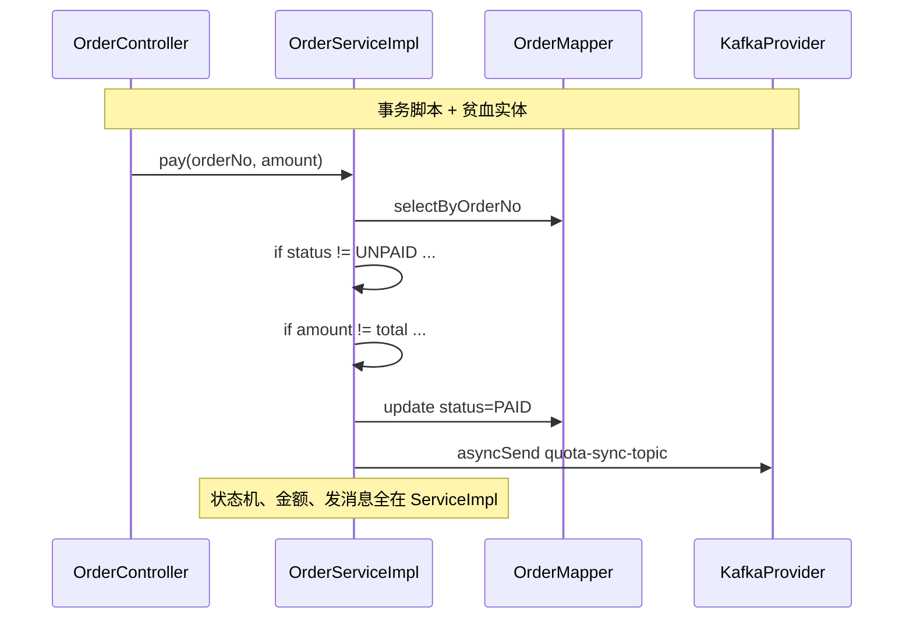
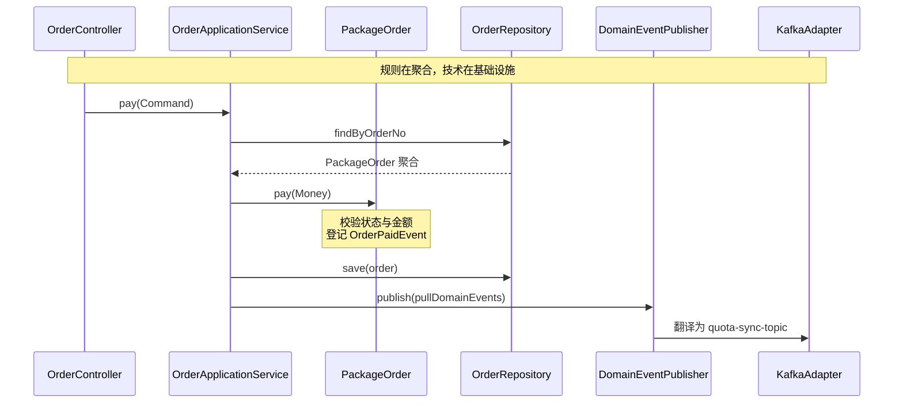
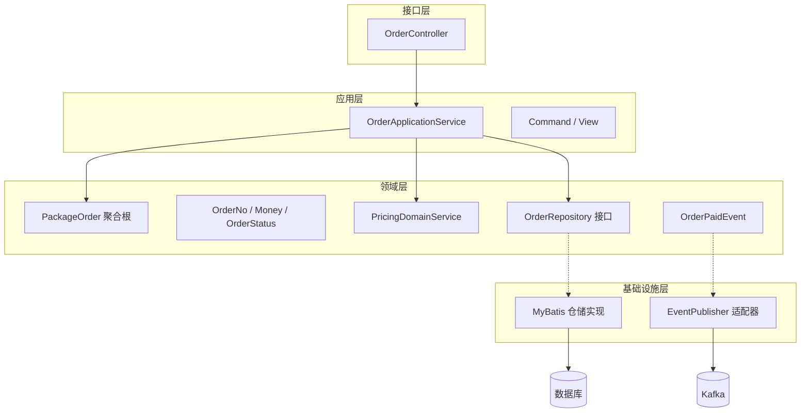
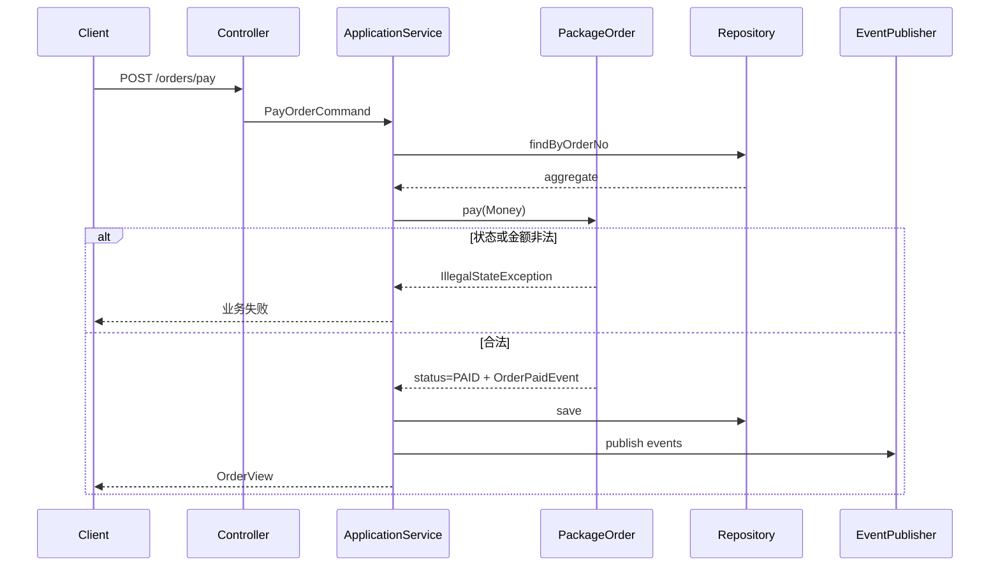
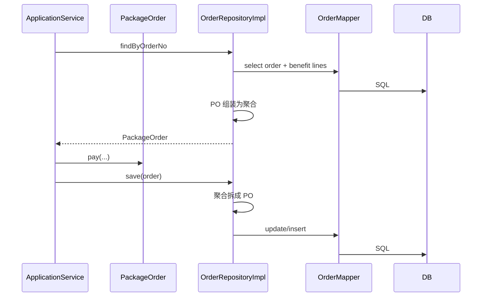

## 1. 案例概述

### 1.1 一句话概括

当订单支付、取消、退款、权益开通等规则堆进上千行 `ServiceImpl`，表实体只有 getter/setter 时，包名叫 `domain` 也不等于 DDD；通过独立 Demo 把**聚合根、值对象、仓储端口、领域事件**落到四层结构，并澄清：**DDD 不取消 MyBatis，只是让表映射服务于领域，而不是冒充领域**。

### 1.2 背景与目标

| 维度 | 说明 |
|------|------|
| 场景 | 电商/SaaS 运营侧「套餐订单」：创建、支付、取消，支付后同步配额到下游 |
| 痛点 | 状态机散落、规则难测、改一处漏一处；误以为上 DDD 就不用数据库映射 |
| 目标 | 用可运行 Demo 讲清战术构件与依赖方向，对照典型三层贫血现状 |
| 约束 | Demo 独立于正式父工程；教学可用内存仓储，生产路径仍接 MyBatis |

### 1.3 问题与修复对照

#### ❌ 典型写法：规则与持久化、MQ 搅在一起



#### ✅ 目标写法：应用编排 + 聚合不变式 + 事件出口



### 1.4 技术栈

| 层次 | 技术 |
|------|------|
| 教学 Demo | 独立 Spring Boot 模块（不挂正式聚合工程） |
| 领域层 | 纯 Java 聚合 / VO / 仓储接口 / 领域事件 |
| 持久化（Demo） | 内存仓储 |
| 持久化（生产路径） | MyBatis：`PO ↔ Assembler ↔ 聚合` |
| 消息 | 领域事件 → 适配器 → Kafka |
| 验证 | JUnit 领域单测（不启 Spring、不连库） |

---

## 2. 现状与问题

### 2.1 「有 domain 包」不等于 DDD

很多工程按业务分包（order / product / benefit / pay），枚举也较全，**战略上**已有限界上下文与通用语言雏形。但战术层常见特征是：

| 表象 | 实际 |
|------|------|
| `domain/entity` | 表 PO + `@TableName`，几乎无行为 |
| `domain/req`、`domain/resp` | Web DTO，与领域模型混放 |
| `*ServiceImpl` | 应用编排 + 领域规则 + SQL/MQ 一体 |
| 偶发实体方法 | 如补服务起止时间，远不够覆盖状态机 |

一句话定位：**模块化单体 + 传统三层 + 贫血模型**。

### 2.2 错误代码特征

```java
// ❌ 贫血实体：只有字段，规则在外面
public class OrderEntity {
    private Integer orderStatus;
    private BigDecimal versionAmount;
    private BigDecimal serviceAmount;
    // getters / setters ...
}

// ❌ ServiceImpl 事务脚本（示意）
public void pay(String orderNo, BigDecimal paid) {
    OrderEntity order = orderMapper.selectByOrderNo(orderNo);
    if (!OrderStatusEnum.UNPAID.getCode().equals(order.getOrderStatus())) {
        throw new BusinessException("状态不允许支付");
    }
    BigDecimal total = order.getVersionAmount().add(order.getServiceAmount());
    if (paid.compareTo(total) != 0) {
        throw new BusinessException("金额不一致");
    }
    order.setOrderStatus(OrderStatusEnum.PAID.getCode());
    orderMapper.updateById(order);
    kafkaProvider.asyncSend("quota-sync-topic", buildJson(order)); // 副作用硬编码
}
```

### 2.3 根因链

| 步骤 | 现象 | 本质 |
|------|------|------|
| 1 | Entity = 表行 | 领域概念被持久化模型绑架 |
| 2 | 规则进 ServiceImpl | 状态判断复制粘贴，易漏改 |
| 3 | Mapper / Kafka 直调 | 领域依赖基础设施，难单测 |
| 4 | 包名仍叫 domain | 制造「已经在做 DDD」的错觉 |

### 2.4 次要误区

| 误区 | 澄清 |
|------|------|
| 上 DDD 就不用 MyBatis | 否；映射下沉到基础设施 |
| 所有 Service 改名 DomainService | 带事务/Mapper/MQ 的仍是应用服务 |
| Demo 内存仓储 = 生产方案 | 仅教学；生产仍落库 |
| 全盘重构才叫落地 | 优先规则密集路径局部提炼 |

---

## 3. 方案设计

### 3.1 整体架构



**依赖规则**：`interfaces → application → domain ← infrastructure`。领域不依赖 Spring / MyBatis / Kafka。

### 3.2 模块职责

| 层 | 职责 | 不做 |
|----|------|------|
| interfaces | HTTP/MQ 协议适配 | 状态机、算价 |
| application | 用例编排、事务边界、发事件、转 DTO | 核心不变式 |
| domain | 聚合行为、VO、仓储端口、领域事件 | SQL、Topic 名 |
| infrastructure | Mapper/PO、事件→Kafka、配置装配 | 业务 if/else 堆砌 |

包结构（脱敏示意）：

```text
order-context/
├── interfaces/web/OrderController
├── application/
│   ├── OrderApplicationService
│   ├── command/
│   └── dto/
├── domain/
│   ├── model/          # PackageOrder, Money, OrderStatus...
│   ├── service/        # PricingDomainService
│   ├── repository/     # OrderRepository（仅接口）
│   └── event/
└── infrastructure/
    ├── persistence/    # 内存或 MyBatis 实现
    └── messaging/      # DomainEvent → Kafka
```

### 3.3 核心流程：支付联调时序



### 3.4 生产路径：MyBatis 仍在



关键结论：**领域对象 ≠ `@Table` 实体**；查表 → PO → 聚合 → 行为 → 再写回 PO。

### 3.5 聚合内关键代码（✅）

```java
// ✅ 值对象：非法金额创建不出来
public final class Money {
    public Money add(Money other) {
        assertSameCurrency(other);
        return new Money(this.amount.add(other.amount), this.currency);
    }
}

// ✅ 状态机靠近模型
public enum OrderStatus {
    UNPAID, PAID, CANCELED, REFUNDED;
    public boolean canPay() { return this == UNPAID; }
    public OrderStatus toPaid() {
        if (!canPay()) throw new IllegalStateException("当前状态不允许支付");
        return PAID;
    }
}

// ✅ 聚合根：支付是订单自己的行为
public void pay(Money paidAmount) {
    Money total = totalAmount();
    if (!paidAmount.equals(total)) {
        throw new IllegalStateException("实付与应付不一致");
    }
    this.status = this.status.toPaid();
    this.paidAt = LocalDateTime.now();
    domainEvents.add(new OrderPaidEvent(...));
}
```

应用服务保持「瘦」：

```java
@Transactional
public OrderView pay(PayOrderCommand cmd) {
    PackageOrder order = orderRepository.findByOrderNo(OrderNo.of(cmd.getOrderNo()))
            .orElseThrow(() -> new IllegalArgumentException("订单不存在"));
    order.pay(Money.cny(cmd.getPaidAmount()));
    orderRepository.save(order);
    order.pullDomainEvents().forEach(eventPublisher::publish);
    return toView(order);
}
```

---

## 4. 关键设计选择及原因

### 4.1 四层分包，而不是继续三层堆 ServiceImpl

| 原因 | 说明 |
|------|------|
| 依赖方向 | 领域最稳定，框架可换 |
| 复用入口 | 同一用例可被 HTTP / Listener 共用 |
| 对照痛点 | `domain` 混放 PO 与 DTO 名不副实 |

**备选方案**：维持 Controller → ServiceImpl → Mapper → **放弃原因**（针对复杂订单）：无法把不变式收拢，难无库单测。薄 CRUD 仍可保留三层。

### 4.2 支付/取消放进聚合根

| 原因 | 说明 |
|------|------|
| 不变式内聚 | 状态 + 金额 + 事件同属订单语义 |
| 可测 | 不启容器即可断言非法流转 |

**备选方案**：规则留在 ServiceImpl → **放弃原因**：正是千行事务脚本的来源。

### 4.3 值对象替代裸 `String` / `BigDecimal` / 状态码

| 原因 | 说明 |
|------|------|
| 非法值难创建 | 空单号、负金额、跨币种运算被拒绝 |
| 通用语言 | 代码说「金额」「订单号」 |

**备选方案**：原始类型 + 到处 if → **放弃原因**：校验散落、语义弱。

### 4.4 Repository 接口在 domain，实现在 infrastructure

| 原因 | 说明 |
|------|------|
| 依赖倒置 | 领域不认 Mapper |
| 按聚合读写 | 一次取出主单+明细，保证内存不变式 |

**备选方案**：Service 直接注入 Mapper → **放弃原因**：表结构泄漏进业务。

### 4.5 领域事件，而不是聚合里直接发 Kafka

| 原因 | 说明 |
|------|------|
| 解耦副作用 | 配额同步、通知、审计可多订阅 |
| 领域纯净 | 不知 Topic / JSON 结构 |

**备选方案**：`pay()` 或 Service 内 `kafka.send` → **放弃原因**：中间件与规则耦合；替换成本高。

### 4.6 Demo 用内存仓储；生产仍用 MyBatis

| 原因 | 说明 |
|------|------|
| 教学聚焦 | 先讲清聚合与分层 |
| 避免误解 | 单独强调「不是取消数据库」 |

**备选方案**：Demo 一上来接真实库表 → **放弃原因**：噪声大，易让人以为 DDD=换 ORM。

### 4.7 局部落地，而非全盘重构

| 原因 | 说明 |
|------|------|
| ROI | 状态多、易漏改的路径收益最大 |
| 风险 | 避免大爆炸回归 |

**备选方案**：所有模块统一充血 + 四层 → **放弃原因**：CRUD 模块成本高于收益。

---

## 5. 风险与应对

| 风险 | 应对 |
|------|------|
| 误以为不用数据库 | 文档/评审明确：PO+Mapper 留在基础设施 |
| 应用服务再度膨胀 | 纪律：状态机与金额规则禁止回流 ServiceImpl |
| 聚合过大、一事务改过多表 | 拆上下文或事件最终一致 |
| 事件与本地事务不一致 | 生产用 Outbox / afterCommit（Demo 可先日志） |
| 包名形式主义 | 以行为与依赖方向验收，不以目录名验收 |

---

## 6. 测试要点

| 优先级 | 用例 |
|--------|------|
| P0 | 实付等于应付 → 支付成功且产生 `OrderPaidEvent` |
| P0 | 已支付再次支付 → 失败 |
| P0 | 已支付取消 → 失败 |
| P1 | 权益明细重复编码 / 超上限 → 失败 |
| P1 | 同租户已有待支付单 → 应用层拒绝创建 |
| P2 | MyBatis 仓储往返后不变式仍成立 |
| P2 | `OrderPaidEvent` → Kafka JSON 与消费方契约一致 |

领域单测示例思路：直接 `PackageOrder.create(...).pay(...)`，不断言 Spring 容器。

---

## 7. 深度剖析：常见面试问答

### Q1：为什么有 `domain` 包仍可能不是 DDD？

**考察点**：贫血模型 vs 领域层

**答**：若 `domain` 只是 PO/DTO，规则全在 ServiceImpl，则只是命名；DDD 看规则住哪里、依赖朝哪里。

### Q2：聚合根、实体、值对象如何区分？

**考察点**：身份与一致性边界

**答**：聚合根是外部唯一入口；内部实体有 id 但不可单独持久化出口；值对象无独立生命周期、值相等。

### Q3：DDD 还要不要 MyBatis？领域类能否继续 `@TableName`？

**考察点**：持久化分离

**答**：要。表映射在基础设施；领域聚合不宜直接当表实体，避免表变更倒逼业务语义。

### Q4：领域服务和应用服务怎么分？

**考察点**：职责边界

**答**：领域服务无事务、不调仓储、不发 MQ，做跨实体领域计算；应用服务编排用例并管事务与出口。

### Q5：为什么不在 `pay()` 里直接发 Kafka？

**考察点**：领域事件

**答**：聚合只表达业务事实；Topic/JSON 是技术细节。多订阅、可替换、可测性都更好；生产注意 Outbox。

### Q6：什么时候不要上 DDD？

**考察点**：工程权衡

**答**：规则极少的 CRUD 硬拆会更啰嗦；优先复杂状态路径局部提炼。

### Q7：仓储为什么要一次加载完整聚合？

**考察点**：一致性边界

**答**：明细与主单共同保证不变式；只加载半截聚合，内存校验会失真。

### Q8：局部改造建议从哪条路径切入？

**考察点**：落地顺序

**答**：支付/取消/退款/权益开通等分支最多处：先收状态机与行为，再仓储组装，最后把直发 MQ 改为事件订阅。

---

## 8. 团队规范沉淀

1. **目录名不验收 DDD**：看是否有不变式方法与依赖倒置。  
2. **应用服务禁止堆状态机**：支付/取消等进聚合或领域服务。  
3. **Mapper 不得穿透进领域包**：只出现在仓储实现。  
4. **副作用走领域事件**：禁止在聚合内写死 Topic。  
5. **复杂路径优先局部提炼**：CRUD 保持清晰三层即可。  
6. **领域规则必须有无库单测**：至少覆盖合法与非法状态流转。

---

## 9. 小结

> **核心教训**：DDD 的关键不是多几个文件夹，而是让**业务规则住在领域模型**，让 **MyBatis/Kafka 住在基础设施**；包名 `domain` 装的若是贫血 PO，复杂订单仍会在 ServiceImpl 里失控。先对规则密集路径做聚合与事件拆分，比全盘「架构表演」更有价值。
