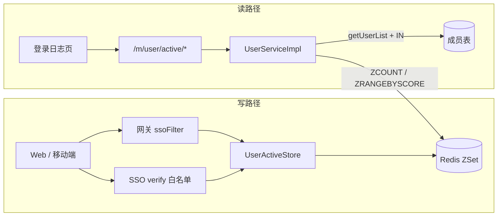
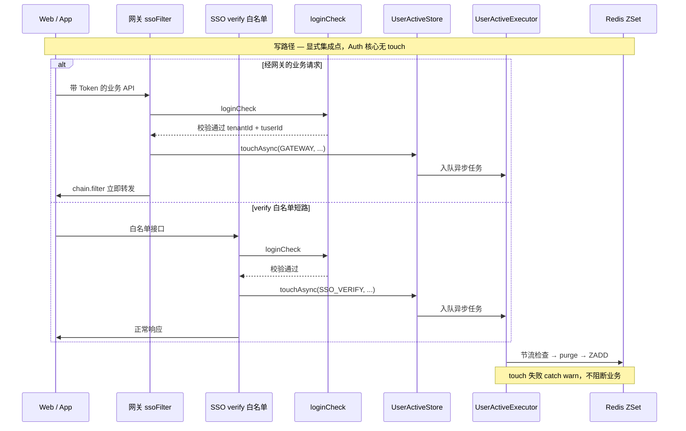
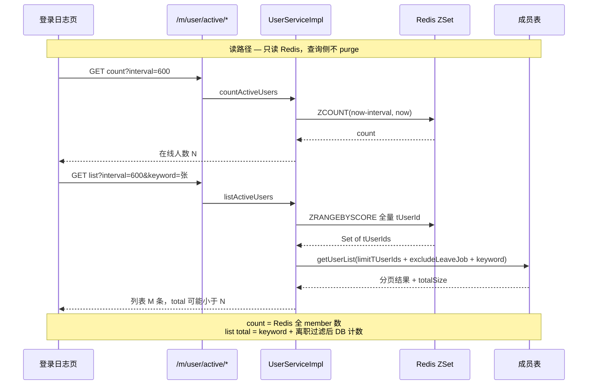
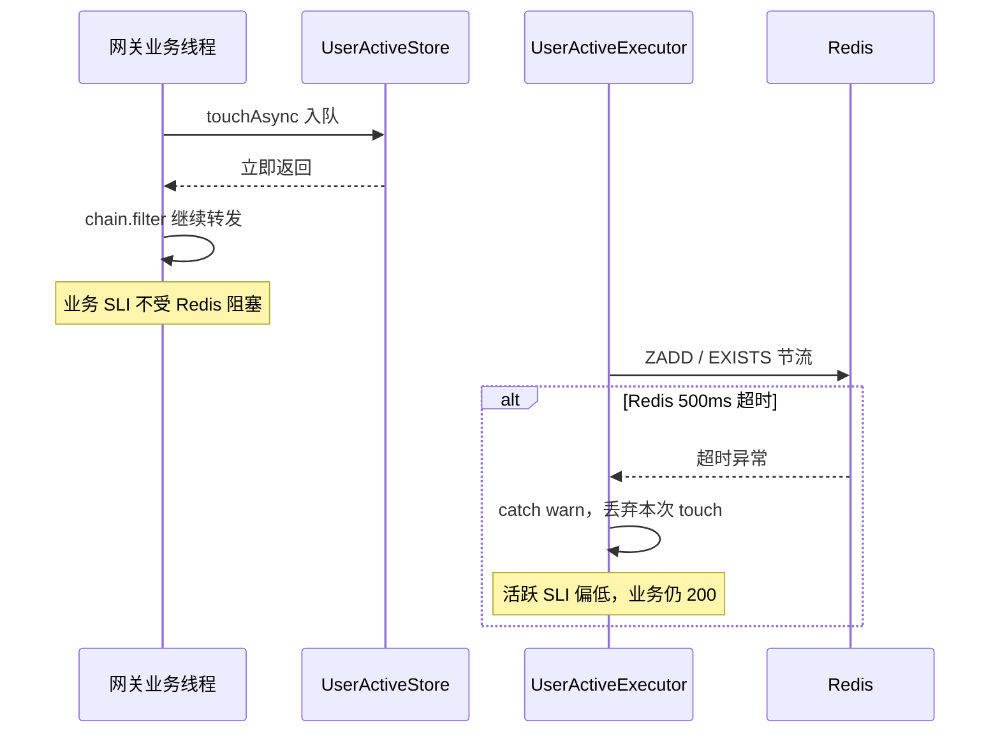

## 1. 背景与目标

### 1.1 一句话概括

在**私有化单点登录（SSO）**部署下，为「登录日志」管理页提供**当前在线人数 + 在线人员列表**：经 **API 网关**与 **SSO 内部校验白名单**双入口异步写入 Redis ZSet；**租户服务**按前端 **interval 活跃窗口**只读 Redis（ZCOUNT / ZRANGEBYSCORE），再复用既有成员列表能力做 keyword 筛选与 DB 分页。**业务活跃 ≠ 会话仍在线**。

### 1.2 背景与目标

| 维度 | 说明 |
|------|------|
| 场景 | 发版前评估「谁正在操作系统」——登录日志页展示在线人数与名单 |
| 部署形态 | 私有化 SSO（网关走 ssoFilter，未启用 OAuth2 主路径） |
| 核心诉求 | 统计 interval 窗口内有带登录态业务请求的用户，而非「登录后挂机」 |
| 约束 | 采集与查询分离；Auth 核心无副作用；touch 失败不阻断业务转发 |

### 1.3 适用与不适用

| 适用 | 不适用 |
|------|--------|
| Web + 移动端双端经网关的业务流量 | OAuth2 为主路径且未补 touch 点 |
| 管理端弹窗与成员列表字段一致 | 需要「会话在线但无操作也算活跃」 |
| 含 verify 白名单短路流量 | 需要展示「最后活跃时间」列 |
| | 要求 count 与 list total **严格相等** |

### 1.4 技术栈

| 层次 | 技术 |
|------|------|
| 网关 | Spring Cloud Gateway 统一鉴权过滤器 |
| 认证 | SSO `loginCheck`（纯校验） |
| 采集 | 认证公共库 `UserActiveStore` + Redis ZSet |
| 查询 | 租户服务 Controller / Service |
| 缓存 API | 平台 Redis 封装（ZADD、ZCOUNT、按 score 区间读取） |
| 成员数据 | MyBatis 成员列表 SQL + 查询参数对象 |

---

## 2. 现状与问题

### 2.1 为什么不能复用「会话在线」接口？

| 指标 | 会话在线 | 业务活跃（本方案） |
|------|----------|-------------------|
| 判定依据 | Token/会话未过期 | interval 内有带登录态的实际 API 请求 |
| 典型偏差 | 登录后挂机仍计入 | 只计「正在操作」的人 |
| 采集面 | 单一 Auth 侧 | 网关 + verify 白名单双入口 |
| 发版决策价值 | 系统性**高估** | 贴近「谁在用系统」 |

若产品坚持复用会话接口，需重新定义指标名称，或并行展示两个数字——**不能共用同一 Redis Key 与接口语义**。

### 2.2 核心设计思想

- **采集与查询分离**：写路径在网关 + 认证侧公共库，读路径在租户服务，不耦合主业务事务。
- **认证核心无副作用**：不在统一 `loginCheck` 内埋运营逻辑，仅在两个**显式集成点**异步 touch。
- **语义独立**：以「窗口内有带登录态业务请求」为准，不复用「会话仍有效」类在线接口。
- **复用优先、失败隔离**：列表对齐既有 `/m/user/list`；touch 失败不阻断业务转发。

---

## 3. 方案设计

### 3.1 整体架构



### 3.2 采集时序（双入口异步 touch）



### 3.3 查询时序（count / list 口径分离）



### 3.4 Redis 活跃存储

| 项 | 约定 |
|----|------|
| Key | `{prefix}user_active:{tenantId}` |
| Type | ZSet |
| Member | `tuserId`（租户成员主键） |
| Score | 最后活跃毫秒时间戳 |
| Touch 节流 | `{prefix}user_active:touch:{tenantId}:{tuserId}`，TTL **10s** |
| Purge 节流 | `{prefix}user_active:purge:{tenantId}`，TTL **10s**（**仅采集侧**） |

**touch 顺序**：touch 节流 → purge（租户节流）→ ZADD → 写 touch 节流 key。

**retention**：默认 **86400s**，采集侧 `ZREMRANGEBYSCORE`；**查询侧不 purge**。

### 3.5 异步 touch 故障隔离



### 3.6 关键代码模式

```java
// ✅ 网关 ssoFilter — loginCheck 成功后显式 touch，不污染 Auth 核心
if (loginResult.isSuccess()) {
    userActiveStore.touchAsync(UserActiveTouchSource.GATEWAY, tenantId, tuserId);
}
return chain.filter(exchange); // 不 await touch

// ❌ 错误写法 — 在 loginCheck 内统一 touch
public LoginResult loginCheck(String token) {
    LoginResult result = doValidate(token);
    userActiveStore.touch(tenantId, tuserId); // Demo/Job/内部工具也会污染指标
    return result;
}
```

```java
// ✅ list 查询 — Redis 取 ID 集合，DB 做 keyword + 离职过滤 + 分页
Set<String> activeIds = redis.zRangeByScore(key, now - interval, now);
UserListQuery query = activeUserList(activeIds)
    .limitTUserIds(activeIds)
    .excludeLeaveJob(true)
    .keyword(keyword);
return getUserList(query); // 复用既有成员列表
```

### 3.7 离职处理

| 路径 | 行为 |
|------|------|
| 主路径离职 | `invalidateToken` + **ZREM** |
| list 兜底 | SQL `excludeLeaveJob` 过滤 |
| count 语义 | 全窗口 ZCOUNT，**不过滤离职** |

---

## 4. 关键设计选择

| # | 决策 | 选定 | 放弃的主备选 | 原因 |
|---|------|------|--------------|------|
| 1 | 存储 | Redis ZSet | SSO 会话扫描 / MySQL 活跃表 | O(log N) 区间计数；天然按 tenant 隔离 |
| 2 | 采集挂载 | 网关 + verify 双点 | loginCheck 单点 / 租户拦截器 | Auth 纯净；避免 Demo/Job 污染 |
| 3 | member | tuserId | pUserId | 再入职不重复行；与 token 身份一致 |
| 4 | count | ZCOUNT | DB 大 IN 计数 | 轻量 O(log N)，不受 keyword 影响 |
| 5 | list | 复用 getUserList | 独立 VO | 字段与权限对齐既有成员列表 |
| 6 | 写放大 | 10s touch + 10s purge 节流 | 不节流 / 60s | 500 人在线约 50 ZADD/s；边界误差 <2% |
| 7 | purge 职责 | 仅采集侧 | 查询侧异步 purge | 有流量时采集 purge 足够；查询热路径只读 |
| 8 | interval | ≥1 无上限 | 硬上限 86400 | 产品灵活；list 侧需演进防护 |
| 9 | 口径 | count 与 list total 可不一致 | 强制 SQL 对齐 | 性能与语义双输 |

### 4.1 为什么不在 loginCheck 里一行搞定？

**长期成本**：每增加一条带登录态且应计入活跃的入站路径，都要人工确认是否调用 `touchAsync`——这是**显式集成**的代价。

**loginCheck 单点的隐藏成本**：Auth 库被 Demo、Cookie 页、内部工具大量调用，一行 touch 会导致**指标污染**且难以回滚。

**最容易踩坑**：

1. 新加 Gateway 白名单直连 SSO Controller → 绕过 ssoFilter，**漏采**；
2. 私有化切 OAuth2 authFilter 为主路径 → 需对称补 touch；
3. 内部 Job 用服务账号调 loginCheck → 若 touch 在内会**虚假活跃**。

---

## 5. 部署与配置

| 配置项（`app.user-active.*`） | 默认 | 说明 |
|-------------------------------|------|------|
| enabled | true | 总开关 |
| touch-throttle-seconds | 10 | 用户 touch 节流 |
| purge-throttle-seconds | 10 | 租户 purge 节流（采集侧） |
| retention-seconds | 86400 | 过期 member 清理 |

网关路径示例：`/t/ten/m/user/active/count`、`/t/ten/m/user/active/list`。

---

## 6. 风险与应对

| 风险 | 应对 |
|------|------|
| 新 SSO 入口漏 touch | 集成 checklist + Code Review |
| 大租户 list 大 IN | 联调 P95；临时表 JOIN 备选 |
| count ≠ list 误解 | 产品文案 + 接口文档 |
| 静默租户 ZSet 膨胀 | 采集侧 retention；interval ≪ retention 时统计不受影响 |
| Redis 故障 | touch 忽略；count 降级返 0 |

---

## 7. 测试要点

| 优先级 | 要点 |
|--------|------|
| P0 | 活跃语义、双端合并、keyword 筛选、离职 ZREM、权限、只读弹窗 |
| P1 | count/list 不一致边界、超大 interval、离职 ZREM 主路径 |
| P2 | 节流单测、5000 人 list P95 ≤ 3s |

---

## 8. 深度剖析：常见面试问答

### Q1：count 与 list total 对不上，是 bug 吗？

**答**：通常**不是**。count = 窗口内 Redis 全 member 数；list total = keyword + excludeLeaveJob 后 DB 计数。有 keyword 时 list total ≤ count 是正常现象。

**排查路径**：

1. 复制 `[user-active] redis> ZCOUNT ...` 日志，redis-cli 对账；
2. 无 keyword 仍不一致 → 查离职未 ZREM 的 count 残留；
3. 检查 interval 前后端是否一致。

**不应**为「数字强行相等」把 count 拉回 DB 大 IN——应改**前端文案**（「在线人数」vs「筛选结果 N 人」）。

### Q2：5000、2 万、10 万活跃 member 时瓶颈在哪？

| 量级 | 评估 |
|------|------|
| 5000 | IN + 索引通常可接受，方案目标量级 |
| 2 万 | MySQL IN 与 packet、内存压力上升 |
| 10 万 | **不应再 IN**；需临时表 JOIN 或异步导出 |

**演进原则**：count 保持 O(log N) ZCOUNT；**list 是大 IN 的唯一点**，优先优化 list 路径。

### Q3：10 秒 touch 节流为什么不是 1 或 60？

- **QPS**：单用户 1 分钟 300 次请求，10s 节流约 **6 次/分钟**；500 在线约 50 ZADD/s。
- **边界误差**：interval 600s 时，停止操作后最多多算 ~10s，占比 <2%。
- **60s** 误差过大；**1s** 写放大仍高。

### Q4：静默租户 30 天无业务流量，ZSet 会怎样？

无 touch → 采集侧 purge 不跑；僵尸 member 仍留在 ZSet。但管理员查 count/list 只读 **interval 窗口**，24h 外僵尸**不影响统计**。

对 Redis 内存是可接受的运维债务；未来可加**定时任务 purge**，而非查询热路径 purge。

### Q5：Gateway touch 异步化，Redis 500ms 慢时 SLI 怎样？

- **业务 SLI**：转发延迟不受 touch 阻塞（需关注 executor 队列与拒绝策略）；
- **活跃 SLI**：touch 失败 catch warn，count 偏低；业务仍 200。

独立 named executor，不用 CompletableFuture 默认 ForkJoinPool——便于隔离与监控。

### Q6：离职 count 含、list 不含——算缺陷吗？

**复现**：用户在职且活跃 → 非主路径标记离职且未 ZREM → token 仍被使用继续 touch → count 计入、list 因 excludeLeaveJob 不展示。

**判断**：产品设计边界，非主路径脏数据。优先**补全离职入口 ZREM**；改 count 牺牲性能，仅当产品强约束。

### Q7：OAuth2 主路径启用时如何避免漏 touch / 双 touch？

- **漏 touch**：authFilter 成功解析后增加 `touchAsync(OAUTH2_GATEWAY, ...)`，与 ssoFilter 对称。
- **双 touch**：部署互斥 `oauth2.enable`；若混合模式，10s 节流 key 使双写降为冗余 ZADD，可接受。
- **M2M 服务账号**：默认不计（无 tuserId 则不 touch）。

### Q8：发版日 QPS 从 10 提到 200，优先优化哪段？

**瓶颈排序**：list 的 ZRANGEBYSCORE 全量 + DB IN >> count 的单次 ZCOUNT。

**优先**：

1. list 短 interval 缓存（5s 内同 tenant+interval+keyword 快照）；
2. 无 keyword 时 count 结果短缓存；
3. DB 侧确保 `u.ID` 索引稳定。

**不先分片**：tenantId 为 key 已自然隔离；QPS 200 对单 Redis ZCOUNT 通常远未触顶。

---

## 9. 团队规范沉淀

1. **touch 点清单**进 Code Review checklist；新增 Gateway 白名单 / OAuth2 路径必须确认是否 touch。
2. **Auth 核心库禁止**在 `loginCheck` 内埋运营逻辑；touch 仅在显式集成点 + 异步执行。
3. **count 与 list 口径**写入接口文档与前端文案，避免用户误解为 bug。
4. **查询侧只读 Redis**；purge / retention 职责在采集侧，查询热路径不加清理。
5. **可观测性最小闭环**：`touch_fail` 计数、`list_active_ids_size` histogram、`zcount_vs_list_total` 采样 diff。

---

## 10. 小结

> 本方案通过 **Redis ZSet + 双入口异步采集 + 租户只读查询** 实现「interval 内有业务请求即活跃」，并以 **tuserId、10s 节流、采集侧 retention、getUserList 复用** 平衡语义、性能与维护性。高级工程师应重点掌握：**口径分离（count vs list）、显式 touch 集成治理、大 IN 演进路径、静默租户与 purge 职责**——而非仅记住 API 路径。
