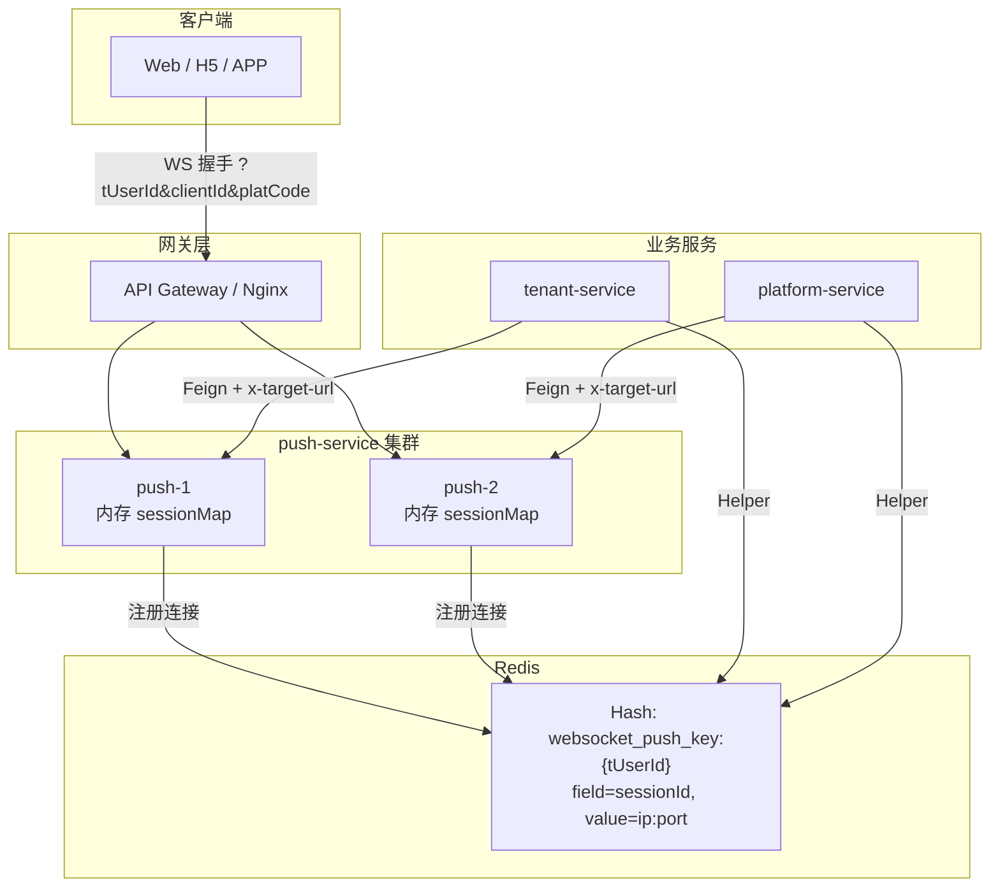
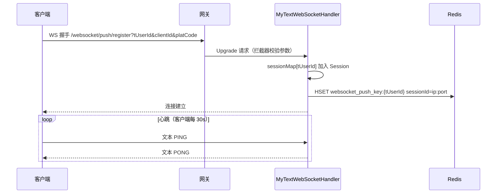
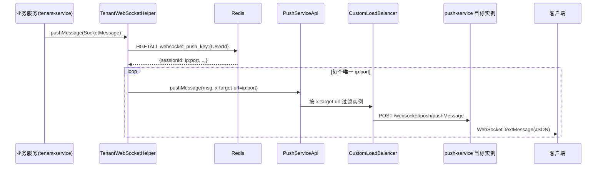
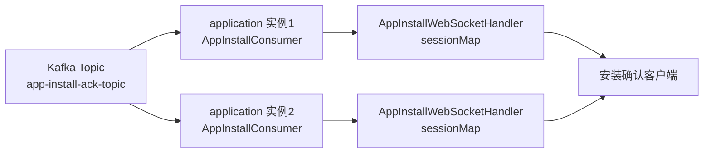

## 1. 背景与目标

### 1.1 一句话概括

在微服务集群下，业务服务（租户 / 平台）需要向指定在线用户实时推送「表单导入 / 导出进度、附件打包下载、单点登录踢出、一键翻译结果」等通知。本方案用 **「客户端长连 push-service + 业务侧 OpenFeign 推送 + Redis 会话路由」** 解决「WebSocket 连接有状态、服务实例无状态」的核心矛盾，并用 **`x-target-url` 精准负载均衡** 把 HTTP 推送请求路由到持有该用户连接的具体节点，实现「业务侧一行 `helper.pushMessage(...)`，指定用户所有端都收到」。

### 1.2 背景与目标

| 维度 | 说明 |
|------|------|
| 场景 | 异步长任务进度 / 结果通知、会话管理（踢出、下线）、跨应用提示 |
| 痛点 | WebSocket 会话对象只存在于建立它的 JVM 进程；业务服务多实例无状态，不知道用户连在哪个节点 |
| 目标 | 业务侧不感知底层连接，一次调用向目标用户全部在线端推送 |
| 约束 | 连接与业务解耦；不引入额外消息中间件；同一用户支持 PC / H5 / APP 多端并存 |

### 1.3 适用与不适用

| 适用 | 不适用 |
|------|--------|
| 点对点、按用户寻址的低 / 中频通知 | 高频批量推送（Feign 跨节点链路放大，需先限频/合并） |
| 多端在线的进度、结果通知 | 必须送达的离线消息（当前无 ACK、无离线存储） |
| 集群下「推送到正确节点」的诉求 | 浏览器降级 / 主题订阅广播（未引入 STOMP / SockJS） |
| 内部受控网络环境 | 公网开放且未补鉴权的场景（当前握手无 Token 校验） |

### 1.4 技术栈

| 层次 | 技术 |
|------|------|
| WebSocket 框架 | Spring WebSocket（`TextWebSocketHandler`） |
| 服务发现 | 注册中心 + Spring Cloud（Nacos） |
| 跨服务调用 | OpenFeign（`PushServiceApi` Feign Client） |
| 会话路由 | Redis Hash（`websocket_push_key:{tUserId}`） |
| 精准负载均衡 | 自定义 `x-target-url` 规则（`CustomLoadBalanceRuleLoadBalancer`） |
| 安装确认链路 | Kafka 广播（独立于通用推送） |

---

## 2. 现状与问题

### 2.1 为什么业务服务不能直接持有连接？

| 指标 | 业务服务（tenant / platform） | push-service |
|------|-------------------------------|--------------|
| 实例形态 | 多实例、无状态、可任意扩缩 | 专门承接长连接，按连接量扩容 |
| 会话归属 | 不持有任何 WebSocket Session | 内存 `sessionMap[tUserId] -> Set<Session>` |
| 推送职责 | 只知道「用户 ID」，不知道用户连在哪 | 知道每个连接在哪个实例 |

结论：连接与业务必须解耦。业务侧只发指令，由 push-service 集群持有连接，路由信息落在 Redis。

### 2.2 为什么不能全节点广播？

「业务把推送消息发给所有 push-service 实例，每实例本地查 sessionMap 命中即发」是最朴素方案，但代价是：**N 个实例消费 N 份消息**、每个实例都要持有可能用不到的全量连接、消息对无关节点可见。对于「按用户精确寻址」的点对点场景，广播是浪费；精准路由才是与量级匹配的答案（见 §4.1）。

---

## 3. 方案设计

### 3.1 整体架构



### 3.2 模块职责

| 类 | 模块 | 职责 |
|----|------|------|
| `WebSocketConfig` | push-service | 注册端点 `/websocket/push/register`、挂握手拦截器 |
| `WebSocketInterceptor` | push-service | 校验握手 Query 参数（`tUserId` / `clientId` / `platCode`） |
| `MyTextWebSocketHandler` | push-service | 维护本地 `sessionMap`、写 / 清 Redis 路由、`sendToAllClient` |
| `WebSocketPushController` | push-service | HTTP 推送入口（本机推送 / 测试链路） |
| `SocketMessage` | message-openfeign-client | 推送请求 DTO（`tUserIds` / `messageType` / `data`） |
| `TenantWebSocketHelper` | tenant-application | 查 Redis 路由 → Feign 推送；URL 去重、异常清脏 |
| `WebSocketFeignHelper` | commons | 同职责普通版（无去重、无异常清理，存在缺陷） |
| `PushServiceApi` | Feign Client | `@FeignClient("push-service")`，Header `x-target-url` 指定目标实例 |
| `CustomLoadBalanceRuleLoadBalancer` | web-spring-boot-starter | 优先按 `x-target-url` 匹配 `host:port` |

### 3.3 连接注册时序



### 3.4 跨服务推送时序（核心链路）



### 3.5 Redis 会话路由表

| 项 | 约定 |
|----|------|
| Key | `websocket_push_key:{tUserId}` |
| Type | Hash |
| Field | WebSocket Session ID |
| Value | `{push-service IP}:{port}` |

同一 `tUserId` 一个 key、多个 field（多端 / 多节点并存）；`HGETALL` 一次拿全，按唯一 `ip:port` 去重后逐个 Feign。

### 3.6 下行消息体（SocketMessageInfo）

```json
{
  "clientId": "PC",
  "platCode": "client",
  "messageType": "FORM_IMPORT_ING",
  "data": { "...": "..." }
}
```

### 3.7 应用安装确认（独立链路）



- 端点 `/ws/ten/websocket/app/install/ack`，无握手拦截器、无鉴权（已知缺陷，见 §5.3）。
- 客户端发 `{"userId":"xxx"}` 绑定 Session；`@KafkaListener` 用随机 `groupId` 广播，每个实例消费同一条消息保证本地命中。

---

## 4. 关键设计选择及原因

### 4.1 Redis 路由 + 精准 Feign 而非全节点广播

| 原因 | 说明 |
|------|------|
| 点对点寻址 | 业务只推「指定用户」，广播到所有实例是无谓放大 |
| 成本可控 | 一次推送 = 1 次 HGETALL + k 次 Feign（k=目标节点数，通常 1） |
| 复用既有设施 | Feign + 注册中心 + 网关已成熟，业务侧改动最小 |

**备选**：业务侧发 MQ、所有实例广播消费 → **放弃原因**：N 实例消费 N 份、消息对无关节点可见；只有在推送量级大到 Feign 链路成为瓶颈时才值得切换（演进方向见 Q14）。

### 4.2 会话路由用 Redis Hash 按用户分片

| 原因 | 说明 |
|------|------|
| 天然支撑多端 | 一个 `{tUserId}` key 下多个 field，PC / H5 / APP 并存 |
| 查询即推送 | `HGETALL` 一次拿到全部节点，按 ip:port 去重后精确投递 |
| 结构简单 | 无需额外路由中间件 |

**备选**：Redis 存整个 Session 对象 → **放弃原因**：Session 不可跨进程序列化；Hash 的 `sessionId -> ip:port` 映射才是可路由的最小信息。

### 4.3 `x-target-url` 精准负载均衡而非 Sticky Session

| 原因 | 说明 |
|------|------|
| 命中持有者 | 推送必须到「持有该用户连接」的具体实例，轮询 / 权重会 miss |
| 实现轻量 | 在既有 LoadBalancer 上增加按 Header 过滤的逻辑即可 |
| 无状态 | 不引入一致性哈希等复杂机制 |

**备选**：Nginx sticky session / 一致性哈希 → **放弃原因**：sticky 只解决握手分发、不解决推送寻址；一致性哈希对「连接迁移」场景收益低、复杂度高。

### 4.4 原生 `TextWebSocketHandler` 而非 STOMP / SockJS

| 原因 | 说明 |
|------|------|
| 轻量 | 点对点自定义协议足够，无需 STOMP 订阅模型 |
| 学习成本低 | 原生 API 直连，团队易上手 |
| 无额外中间件 | 不引入 Stomp Broker / MQ |

**备选**：Spring WebSocket + STOMP / SockJS → **放弃原因**：改动面大；当前无浏览器降级与主题订阅强需求，列为低优先级演进。

### 4.5 应用层文本 PING/PONG 而非协议帧

| 原因 | 说明 |
|------|------|
| 穿透代理 | 文本消息走业务 payload，网关 / 负载均衡可正常转发（协议层 ping/pong 帧可能被中间件吞掉） |
| 双作用 | 既探活，又为将来「TTL 续期清脏路由」预留时机 |
| 简单 | 无需配置帧间隔 |

**备选**：RFC6455 协议层 ping/pong / TCP keepalive → **放弃原因**：协议帧在代理链上可能被丢弃；TCP keepalive 粒度不可控、不感知业务 Session。

### 4.6 断开只删 field、不删整 key

| 原因 | 说明 |
|------|------|
| 集群并发写 | 用户在节点 A 断开时可能在节点 B 还有连接，整 key 删除会误伤其他节点刚注册的 field |
| 幂等简单 | 按 sessionId 精确 `HDEL` field，天然幂等 |

**备选**：引用计数删除整 key / 定期对账 → **放弃原因**：引用计数跨节点有并发一致性问题；对账成本高，仅列中优先级改进（见 §5.2）。

### 4.7 双 Helper 应合并收敛（可维护性）

| 原因 | 说明 |
|------|------|
| 行为不一致 | `WebSocketFeignHelper` 无 URL 去重、无异常清理、空路由 `return` 中断；`TenantWebSocketHelper` 具备增强能力 |
| 缺陷温床 | 两个实现差异即 Bug 温床（同语义双实现） |
| 触达点收敛 | 未来加 TTL、埋点时只改一处，防止新入口漏改 |

**备选**：保留双实现、按服务选用 → **放弃原因**：差异是缺陷级而非场景级，合并到增强版统一注入点是更优解。

### 4.8 消息「尽力而为」而非强可靠

| 原因 | 说明 |
|------|------|
| 业务可容忍 | 进度 / 结果类通知重发意义有限，用户刷新即可 |
| 实现成本 | 全链路 ACK + 离线存储代价高，当前收益不明显 |

**备选**：消息序号幂等（`msgId`/`seq`）+ 失败重试 + 离线消息 → **放弃原因**：列为中 / 低优先级改进；当前推送失败仅打日志（待实现确认）。

---

## 5. 已知缺陷与改进建议

### 5.1 多用户推送提前 return（正确性 Bug）

```java
// ❌ 错误：首个用户无 Session 时直接 return，终止整个循环，后续用户收不到
for (String tUserId : socketMessage.gettUserIds()) {
    Set<WebSocketSession> sessions = sessionMap.get(tUserId);
    if (CollectionUtil.isEmpty(sessions)) {
        log.debug("未查询到WebSocketSession tUserId={}", tUserId);
        return; // Bug：应改为 continue
    }
    // 向每个 session 发送
}
```

```java
// ✅ 正确：跳过当前用户，继续处理 batch 里的其他用户
if (CollectionUtil.isEmpty(sessions)) {
    log.debug("未查询到WebSocketSession tUserId={}", tUserId);
    continue;
}
```

`return` 结束整个方法，`continue` 只跳过当前迭代。这个 Bug 只在「多用户推送且首位离线」时触发，单用户场景完全正常，因此很容易被单用户测试放过。

### 5.2 握手无 Token 鉴权 + CORS 全放开（安全）

| 问题 | 影响 |
|------|------|
| 握手仅校验 Query 参数存在性，无 Token 鉴权 | 拿到他人 `tUserId` 即可建连接收该用户实时消息，含 `offline` 踢出语义（可伪造踢人） |
| `setAllowedOrigins("*")` | 攻击面扩大到任意来源网页 |
| 身份绑定缺失 | 应「以 Token 解析出的用户为准」，而非信任客户端传入的 `tUserId` |

**改进**：`WebSocketInterceptor.beforeHandshake` 校验 accessToken（JWT），复用已注释的 `validWebSocketToken` 逻辑或网关鉴权后透传；CORS 改为白名单域名。

### 5.3 脏路由与独立链路无鉴权（可靠性 / 安全）

| 问题 | 改进 |
|------|------|
| 节点宕机时 `afterConnectionClosed` 不触发，Redis 残留指向死节点的 field | field 加 TTL（如 90s）+ 客户端 PING 续期，宕机后自动过期 |
| `TenantWebSocketHelper` 在 `RetryableException` 时清理脏数据，但普通 Helper 无此能力 | 合并 Helper 统一增强能力（§4.7） |
| 应用安装 WS 无鉴权、`userId` 自报 | 增加 Token 校验；以 Token 身份为准绑定会话 |
| Kafka 随机 groupId 广播，实例越多消费越多 | 改固定 groupId + Redis 路由，与通用推送统一（演进） |

---

## 6. 风险与应对

| 风险 | 应对 |
|------|------|
| 多用户推送漏发（提前 return） | 改为 `continue`；构造「首位用户离线」回归用例 |
| 越权接收 / 伪造下线消息 | 握手 Token 校验 + CORS 白名单（高优先级） |
| 握手仅验 Query 存在性、`allowedOrigins("*")` 全放开 | 高优先级：拦截器校验 accessToken（JWT）或网关鉴权透传 `tUserId`；CORS 白名单化 |
| 双 Helper 行为不一致（无去重 / 清理、空路由中断） | 高优先级：废弃 / 合并为单一增强版实现 |
| Redis 故障导致推送全断 | 连接仍存活、业务主流程不受影响（通知旁路）；Helper 失败应降级为日志不阻断业务 |
| 节点宕机残留脏路由 | field TTL（如 90s）+ PING 续期；异常推送时主动清脏 |
| 用户最后连接断开不删整 key（集群安全 vs 数据残留） | 中优先级：引用计数或定期对账 `sessionMap` 与 Redis（现状残留空 key 为换取并发安全的可接受代价） |
| 推送失败仅日志，无重试 / 离线 / ACK | 中优先级：区分「连接关闭」（清理）与「瞬时错误」（限次重试）；`msgId`/`seq` 幂等 |
| 高频推送压垮客户端 / 推送线程 | 业务侧限频合并；push-service 发送队列丢弃旧进度消息；监控连接数与推送量 |
| 应用安装 WS 无鉴权、Kafka 随机 groupId 广播成本随实例线性增长 | 低优先级：加鉴权；改固定 groupId + Redis 路由与通用推送统一 |

**修复优先级**：先正确性与安全（§5.1、§5.2）→ 再可靠性（TTL、重试、幂等）→ 后架构演进（Redis Pub/Sub 解耦、STOMP、监控）。

---

## 7. 测试要点

| 优先级 | 用例 |
|--------|------|
| P0 | 多用户推送：`tUserIds` 两个用户、首位离线，断言第二位仍收到消息 |
| P0 | 握手校验：缺任一 Query 参数拒绝连接；非法来源拒绝 |
| P0 | 跨节点精准推送：用户连 push-2，Feign 带 `x-target-url` 精确送达 push-2 |
| P1 | 多端在线：同一 tUserId 的 PC 与 H5 同时在线，推送双端均收到 |
| P1 | 断开清理：正常断开后 Redis field 与本地 sessionMap 同步移除 |
| P1 | 脏路由清理：`RetryableException` 触发时 Redis 脏 field 被清除 |
| P1 | 心跳：PING → PONG；服务端关闭连接后客户端触发重连 |
| P2 | 应用安装广播：Kafka 消息到达各实例，绑定 userId 后收到安装结果 |
| P2 | 高频进度推送：连续推送下客户端不堆积、推送线程不被打爆 |

---

## 8. 深度剖析：技术负责人视角问答

> 14 题；模拟**技术负责人**考核**高级 / 资深**后端工程师。每题答案含结论先行、背景与原理、结合本方案、边界与权衡，可当学习材料通读。

### Q1：为什么不用「业务发 MQ、所有 push-service 广播消费」这种更简单的方案，而要引入 Redis 路由 + `x-target-url` 精准路由？（架构模型）

**考察点**：架构选型的成本意识；是否理解「连接有状态」与「广播的代价」；长期维护成本视角。

**结论**：在当前**点对点、按用户寻址**的业务形态下，Redis 路由 + 精准 Feign 是合理的；但必须清楚它的成立条件是「一人一推、低频到中频」。一旦走向高频批量推送，广播式反而可能是更简单正确的答案——选型没有绝对最优，只有与量级匹配。

**背景与原理**：WebSocket 是「长连接 + 有状态」：会话对象只存在于建立它的那个 JVM 进程里。业务服务是多实例无状态的，它只知道「用户 ID」，不知道「用户连在哪个节点」。广播式方案让每个 push-service 实例都消费同一份推送指令，自然命中持有者，但代价是：N 个实例就消费 N 份、消息体对所有节点可见、且所有实例都要持有全量 sessionMap。精准路由则把「寻址」拆成两跳——先查 Redis 路由表拿到目标节点，再精确投递，代价是「多一次查询 + 一次跨节点调用」。

**结合本方案**：本案是典型的「两跳寻址」：Helper 先 `HGETALL websocket_push_key:{tUserId}`，得到 `{sessionId: ip:port}` 映射，按唯一 ip:port 去重；再对每个目标节点发 Feign，Header 带 `x-target-url`，由 `CustomLoadBalanceRuleLoadBalancer` 过滤出指定实例。这个链路对「向单个用户、低频、短消息」的进度通知非常契合——一次推送 = Redis 一次 HGETALL + 目标节点一次 Feign，成本低、消息不重复、不打扰无关节点。

**边界与权衡**：当推送变成「对一个用户高频刷进度」（如导入进度每几百毫秒一条）时，Redis 读放大 + Feign 建立成本会让 HGETALL 与 HTTP 调用成为瓶颈——此时更适合把「会话所在节点」缓存在业务侧本地，或改用 Redis Pub/Sub 让各节点自订阅（见 Q14）。另外要注意：Redis 是路由的单一事实来源，它挂了，即使业务服务活着也推不出去——这就是「路由外置」与「依赖中间件」的交换。

**追问**：如果某个用户 500ms 一条导入进度，QPS 会放大到多少？Redis HGETALL 与 Feign 各占多少开销？你会怎么决定「继续精准路由」还是「切广播」？

### Q2：`sendToAllClient` 里把首个无 Session 用户的 `return` 改成 `continue`，这个 Bug 属于哪一类缺陷？为什么它能在代码评审中漏网？（可维护性 / Code Review）

**考察点**：缺陷分类能力；对「正确性 vs 性能微优化」冲突的敏感度；评审习惯。

**结论**：这是典型的**控制流语义错误**：把「跳过当前用户」写成了「终止整个推送循环」，属于正确性缺陷。它在评审中漏网，是因为 Bug 藏在「性能守护代码」里，且**只在多用户推送且首位用户离线时触发**——单用户场景完全正常，测试很容易被单用户用例骗过。

**背景与原理**：`return` 结束整个方法，`continue` 只结束当前迭代。在遍历多个 `tUserId` 时，「没找到该用户的 Session」是常态（用户可能刚好离线），此时应跳过、继续下一个；`return` 则把「第一个离线用户」变成了「全体用户都不发」。这类 Bug 是「早退优化」（early-return）误用的典型：开发者为了省掉空集合的无谓处理，顺手 return，却忽略了这是循环体内。

**结合本方案**：代码在 `MyTextWebSocketHandler.sendToAllClient` 的循环内：

```java
for (String tUserId : socketMessage.gettUserIds()) {
    Set<WebSocketSession> sessions = sessionMap.get(tUserId);
    if (CollectionUtil.isEmpty(sessions)) {
        log.debug("未查询到WebSocketSession tUserId={}", tUserId);
        return; // Bug：应改为 continue
    }
    // 向每个 session 发送
}
```

正确写法是 `continue`，让「离线用户」只跳过自己、不影响 batch 推送里的其他人。**回归用例构造**：`SocketMessage.settUserIds` 放入两个用户，第一个不建连接，断言第二个仍收到消息。

**边界与权衡**：修复成本一行，但提醒两点：一是凡「空集合早退」出现在循环内都要警醒；二是 batch 推送接口的存在本身扩大了影响面——若只有单用户推送，此 Bug 永远不会暴露，这也是为什么必须显式构造多用户用例，而不能只依赖真实流量回归。

**追问**：除了 `return`，这段代码还有哪些「性能守护」写法容易藏正确性 bug？你会加什么单元测试 / 静态检查来防止它复发？

### Q3：为什么「断开时只删 Redis field、不删整 key」？把整个 key 删了不是更干净吗？（一致性 / 运维）

**考察点**：集群并发下的一致性认知；是否理解「想当然的清理」会引入更大问题。

**结论**：不删整 key 是**正确的集群自我保护**，不是偷懒。同一用户可能同时在多个节点有连接（多端在线），删整 key 会在「其他节点正要注册 / 推送」的瞬间误伤它的路由；代价是残留少量空 key，换取了并发安全。

**背景与原理**：`websocket_push_key:{tUserId}` 是**跨进程共享**的 Hash，各节点对它并发读写：节点 A 断开时清自己的 field，节点 B 的同名用户连接可能正在注册新 field。若断开逻辑「无连接了就删整 key」，在 A 删 key 与 B 注册之间有时间窗：B 的注册可能基于「key 已被删」的空状态写入，或者 A 的 DEL 把 B 刚写的 field 一起删掉，导致 B 推送失效。Redis 的 DEL/HSET 不是原子的复合操作，任何「先查后删」都不安全。

**结合本方案**：`clearClosedSession` 只做 `HDEL sessionId` + 本地 `sessionMap` 移除，key 留着不删。代价是：用户完全离线后 key 还在，只有 field 没了，Redis 里会有空 Hash 残留。改进方向（中优先级）是给 field 加 TTL（如 90s）+ 客户端 PING 续期，让**节点异常宕机**（连 close 回调都没有）时的脏 field 也能自动过期。

**边界与权衡**：「不删整 key」解决的是**正常断开**；真正的痛点其实是**异常宕机**——进程被 kill 时 `afterConnectionClosed` 不触发，Redis 里留下指向死节点的 field，业务侧 Feign 到死节点会 `RetryableException`。增强版 Helper 正是在这种异常里主动清理脏 field。所以完整的健壮性是三件套：正常断开精确 HDEL + 宕机兜底 TTL + 异常推送时主动清脏。

**追问**：如果一定要做到「用户全离线时 key 也删掉」，在集群并发下你会怎么设计才安全？（提示：Lua 脚本 / 引用计数 / 对账扫描，各自的代价）

### Q4：握手环节只有 Query 参数存在性校验、没有 Token 鉴权，为什么这是高优先级风险？最小成本怎么修？（安全）

**考察点**：安全意识与修复成本权衡；是否清楚「鉴权位置」的选择余地。

**结论**：这是高优先级，因为它是**越权风险**：任何拿到别人 `tUserId` 的人都能建立连接并接收该用户的实时消息（含 `offline` 下线指令语义、导入结果等敏感业务数据），且 `allowedOrigins("*")` 让攻击面扩大到任意来源网页。最小成本修法是在**握手拦截器**校验客户端携带的 accessToken，同时把 CORS 白名单化。

**背景与原理**：WebSocket 握手是普通 HTTP Upgrade 请求，可以携带 Header / Cookie / Query。校验应该发生在 `beforeHandshake`：验 Token 失败直接返回 false 拒绝连接，客户端就进不来。`allowedOrigins("*")` 意味着任何网页 JS 都可以发起 WS 连接（虽然浏览器跨域 WS 也受 Same-Origin 影响，但配合无鉴权就是裸奔）。

**结合本方案**：`WebSocketInterceptor.beforeHandshake` 目前只查 Query 参数**存在性**（tUserId/clientId/platCode）。修复：校验 accessToken（JWT）有效性，并**以 Token 解析出的用户身份为准**，而不是信任客户端传入的 `tUserId`（防止传别人的 ID）。CORS 方面把 `setAllowedOrigins("*")` 改为配置化白名单域名。

**边界与权衡**：三个关键点：一是**校验位置**——若网关已统一鉴权，可让网关校验后把已验证的 `tUserId` 透传，避免 push-service 重复接 SSO；二是**身份绑定**——必须「以服务端解析的 Token 身份为准」，否则传参校验形同虚设；三是**下线消息的双向性**——`offline` 这类指令如果被伪造发送，等于任意踢人下线，这比单纯信息泄露更严重。当前方案未实现这些，属待实现确认项。

**追问**：Token 放在 Query 里 vs Header/Cookie，对 WebSocket 握手有什么可用性差异？如果走网关统一鉴权，push-service 如何防「绕过网关直连」？

### Q5：应用安装链路无鉴权、还能用任意 `userId` 绑定 Session，线上攻击面怎么评估？怎么改造？（安全 / 领域语义）

**考察点**：对「独立小链路」的安全审查能力；改造时的成本意识。

**结论**：这是与通用推送**相同等级的越权**，只是传播面小：攻击者可冒名接收任意用户的安装进度回执，或让合法用户的推送被误导。改造优先级应与通用推送鉴权一致，且改造时应顺手把 Kafka 广播（UUID groupId）改为固定 groupId + Redis 路由，与通用推送收敛为同一套模式。

**背景与原理**：这条链路是「谁连都能连，绑定谁自己说了算」：客户端先建 WS 连接，再发 `{"userId":"xxx"}` 声明自己是哪个用户。服务端不校验该 userId 是否属于当前客户端，等于把「身份声明」完全交给客户端。而消息来源是 Kafka 广播，每个实例用随机 groupId 消费同一条，保证持有该用户连接的实例能收到——这是「广播 + 本地命中」的设计，也意味着**每个实例都在消费全量安装消息**。

**结合本方案**：改造三步：① 增加握手鉴权（与 Q4 相同的 Token 校验）；② 会话绑定时以 Token 解析出的 `tUserId` 为准，忽略客户端自报的 userId；③ Kafka 消费从 `UUID.randomUUID()` 改为固定 groupId，并改用 Redis 路由 + 精准投递（复用通用推送的 `x-target-url` 模式），实例数越多省得越多。注意 ② 必须连握手鉴权一起做，否则只验 token 不绑身份依旧可冒名。

**边界与权衡**：这条链路当前**量级小、语义简单**，因此改造不急着做（低优先级），但「无鉴权」是硬伤，风险不因量级小而消失。权衡点：直接统一进通用推送通道最彻底，但改动面大、风险集中在「两套会话模型并轨」；先做鉴权 + 绑定、后做通道收敛，是风险更小的渐进路线。

**追问**：随机 groupId 广播在实例数为 N 时的消息放大倍数是多少？如果将来要改 Redis 路由模式，消费语义从「广播」变「精准」，需要考虑哪些兼容问题？

### Q6：同一 `tUserId` 支持多端（PC/H5/APP）多 Session，`offline` 踢出时怎么保证「只踢对应端」？（领域语义）

**考察点**：领域建模能力；对「多端并存」设计的边界意识。

**结论**：多 Session 并存本身设计正确，但当前方案在「踢出」语义上是**模糊的**：`offline` 消息按 `tUserId` 推送，会送达该用户的**所有端**，所谓「只踢旧会话」依赖的是业务侧登录时明确指定目标 clientId/token 范围，而非 WebSocket 层自动分端。要严格实现分端踢出，下行消息需携带 `clientId`/`sessionId` 目标，push-service 端过滤后投递。

**背景与原理**：`sessionMap[tUserId] -> Set<WebSocketSession>` 是一个用户多会话的集合。推送默认遍历**全部** Session——即「发给这个人的所有设备」。若要做「只踢旧设备」，要么由推送方在 `SocketMessage` 中带目标维度，要么 push-service 提供「按 sessionId 定向推送」接口，否则就是全端广播。

**结合本方案**：`SocketMessage` 有 `clientId`（PC/H5/APP）与 `platCode` 字段，但目前推送只按 `tUserIds` 全量发，`clientId` 更像元数据而非过滤条件。单点登录踢出（`offline`）实际是登录令牌服务在写入新 Token 时，把旧登录会话的 tUserId 广播 offline——**无法保证只踢旧端**（未明确分端逻辑，待实现确认）。要实现精确踢出：消息带目标 `clientId`，push-service 过滤 `session` 上的 clientId 再发。

**边界与权衡**：「全端广播」在大多数通知场景（导入完成、翻译结果）反而符合预期——用户哪个端在线都能收到；只有**踢出 / 登录互斥**场景需要分端语义。所以更合理的模型是：默认全端，踢出类消息走定向。另外多端并存还带来 `offline` 后的重连陷阱——客户端收到 offline 要停止重连，否则被踢的设备会立刻重新连上。

**追问**：如果产品要求「同一账号同一时间只能一个端在线」，是改 push-service 过滤还是改登录侧做互斥？两种方案的职责边界分别在哪？

### Q7：增强版 Helper 和普通 Helper 两个实现并存，你会怎么处理？什么情况该合并、什么情况该保留？（可维护性 / 架构边界）

**考察点**：代码坏味道的识别；合并与保留的边界判断，而不是无脑「统一」。

**结论**：应**合并为一个实现**，但保留增强能力（URL 去重、异常时清脏数据），以增强版为基准。这是「同语义双实现 + 行为不一致」的典型坏味道：差异恰恰是 Bug 温床。

**背景与原理**：两个类职责完全相同（查 Redis 路由 → Feign 推送），但行为不同：普通 Helper 无 URL 去重、无异常清理、空路由时 `return` 中断；增强版具备去重与脏路由清理。**差异不是特性而是缺陷**——不同调用方收到不同可靠性。合并的判据是：职责同构、调用方无结构差异、行为差异属于「缺陷 vs 修复」而非「场景定制」。

**结合本方案**：合并方案：以增强版为准，统一注入点（如 Spring Bean 单例），另一侧改用同一实现；`SocketMessage` 结构不变，业务调用方改动仅限注入类替换。合并后必须回归验证原普通版侧推送场景（导出、下载通知）不因「新增去重 / 清理」而行为退化——去重不会，清理需确认不误删正常连接。

**边界与权衡**：什么时候**不该**合并？当两个实现的差异是「真实业务差异」（如不同推送策略、不同熔断参数、不同 trace 链路）时，合并反而是过度抽象。本案差异全是缺陷级差异，合并正确。合并还有一个隐性收益：把「触达点」收敛到一处，未来加 TTL 续期、指标埋点时只改一处，符合「新入口防漏」的治理诉求。

**追问**：合并后如果要在 push 链路加埋点（成功率 / 延迟），你会加在 Helper 层还是 push-service 层？两者的观测范围差异是什么？

### Q8：如果只能先做三件事，鉴权 / 多用户推送 Bug / Redis 脏路由 TTL，你选哪三个、按什么顺序、理由是什么？（工程权衡）

**考察点**：优先级判断；能否用「安全 > 正确性 > 可靠性」之外的业务视角排序；决策可辩护性。

**结论**：选：**① 多用户推送 Bug → ② 握手鉴权 → ③ Redis 脏路由 TTL**。理由：Bug 是纯内部正确性缺陷、改动一行、影响所有 batch 推送用户；鉴权是外部暴露的越权风险、但修复涉及 SSO / 网关协作、周期更长；TTL 是可靠性增强、非故障态影响最小。

**背景与原理**：资源有限时排序的判据应是「影响面 × 概率 × 修复成本」，而不是「听起来最吓人的优先」。三步走：先把**已发生的、确定性的**正确性缺陷修掉（一行改动、全量用户受益、可立即回归）；再堵**开放攻击面**（外部风险，涉及跨服务协作，单次评审完成）；最后做**健壮性增强**（TTL 防宕机脏数据，是低频故障兜底）。

**结合本方案**：① `sendToAllClient` 的 `return→continue`：O(1) 改动，立即消除「batch 推送首位离线就全漏」的确定性缺陷。② 握手鉴权：`WebSocketInterceptor.beforeHandshake` 校验 Token + CORS 白名单，工作量集中在评审与联调。③ Redis field TTL + PING 续期：涉及连接建立 / 心跳 / 断开多处联动与压测，风险最高的排最后。若「只能做一件事」，选 ①——它成本最低、收益确定，且不依赖外部协作。

**边界与权衡**：存在争辩空间：若该服务**公网暴露、且存量用户量巨大**，「鉴权优先」也有充分理由——此时顺序会变成 ②①③。关键是决策要透明：把「风险敞口」「修复成本」「外部依赖」列清楚再排序，而非凭直觉。另外「只做三件」意味着明知有 TTL / 重试 / 幂等未做，这是**接受的已知不完美**，应标注待办，防止团队误以为已覆盖。

**追问**：如果「握手鉴权」卡在「网关不配合、要自研接入」上，你的降级方案是什么？（提示：先做 CORS 白名单 + 服务端再验一次 Token 的轻量版）

### Q9：Redis 故障时，WebSocket 推送链路会发生什么？对「业务成功率」和「可观测性」分别有什么影响？（运维降级）

**考察点**：故障传播与降级理解；能否区分「功能 SLI」与「数据 / 观测 SLI」的边界。

**结论**：Redis 挂掉时：**新连接注册失败、推送寻址失败**，但**已建立的 WebSocket 长连接本身仍存活**（会话在 JVM 内存里）——只是「推送发不出去」。业务侧感知是「实时通知丢失」，而**不会**影响表单导入 / 导出等主流程的完成。这是「通知旁路」架构的最大优点：核心业务不依赖推送。

**背景与原理**：推送链路中 Redis 承担「路由注册」（连接建立时写路由）与「寻址」（推送前 HGETALL）。两个环节都强依赖 Redis：Redis 不可用 → 新连接注册不进路由表 → 后续推送寻址不到节点；已连接用户的消息也推不出去（Helper 拿不到路由）。但 WebSocket 连接是 push-service 与客户端之间的直连，与 Redis 无关，所以**连接不断、心跳正常**——表现是「看起来在线，实际收不到新消息」。

**结合本方案**：故障影响清单：① 连接注册写 Redis 抛异常 → 新连接建立失败（客户端表现为握手后立即关闭）；② `HGETALL` 失败 → Helper 推送抛异常，业务侧需捕获（未明确降级吞异常策略，待实现确认）；③ 客户端 PING 仍能收到 PONG（不需要 Redis）→ 客户端感知不到异常，重连也不会好转。可观测性上，若把「推送成功率」作为指标 SLI，Redis 故障会拉低该指标——但**业务 SLI（导入成功率、登录成功率）不受影响**，排查时应按链路分层定位，避免把「通知失败」误判为「主流程故障」。

**边界与权衡**：降级设计的关键是「失败后业务主流程照常走完」：进度通知只是体验优化，导入任务本身的结果应另有查询途径。更稳的做法是给 Helper 加「Redis 不可用时降级为纯日志」开关，或把推送失败反馈给业务层做补偿（当前未实现）。要警惕的反面：若把「推送成功」错误地写进主流程的成败判定，Redis 故障就会**传染**成业务故障。

**追问**：如果业务方要求「推送失败要有兜底可查」（用户事后能查到当时有没有通知），你会加什么机制？（提示：写推送日志表 / 消息落库 + 重放）

### Q10：一次推送的成本拆解——Redis HGETALL + 每节点一次 Feign，在「高频导入进度」场景下会放大成什么样？要不要做背压？（性能与容量 / 原理 + 定量）

**考察点**：成本估算能力；对「放大因子」的敏感度；背压手段的选择。

**结论**：会放大。设目标用户同时在线 k 个节点（一般 1 个，多端且被分到不同节点时为 k），一次业务推送 = `1 × HGETALL` + `k × Feign` + `push-service 本地 k 次 session 写入`。导入进度若每 500ms 推一次、1 个用户 1 个节点，是 2 次 Redis + 1 次 HTTP / 0.5s，量级很轻；但**批量导入多用户 + 高频率**叠加时，HGETALL 读放大与 Feign 开销会线性增长。背压不是当前首要问题，**限频与合并**才是。

**背景与原理**：HGETALL 是单次 O(n)（n=该用户 session 数），量级恒定；Feign 是跨进程 HTTP，成本比本地调用高一个数量级；session 写入是本地内存操作，最便宜。放大因子主要在 **k（节点数）× 频率 × 用户数**。真正危险的是**推送方不节流**：进度类消息是「状态快照」，永远只需要「最新一条」——客户端看到 100 条中间进度和看到 1 条最新进度，效果几乎一样。

**结合本方案**：本案的具体数据点：`websocket_push_key:{tUserId}` 一次 HGETALL；Helper 对唯一 ip:port 去重后逐个 Feign（已做 URL 去重，这是正确的前置）。瓶颈排序：Feign 跨节点调用 > Redis HGETALL > 本地发送。改进方向：① 业务侧**合并高频进度**（如 500ms 聚合一次、只推最新）；② 把「该用户所在节点」缓存到业务侧本地，省掉每次 HGETALL；③ push-service 侧对单连接发送做**队列 + 丢弃旧消息**（back-pressure / coalescing），防止客户端被高频消息淹死；④ 加连接数 / 推送量指标，超过阈值告警。

**边界与权衡**：「背压」要分清两个层面：对**客户端**的背压（发送队列积压）与对**业务侧**的背压（Feign 线程池打满）。前者通过合并 + 丢弃解决；后者需要业务侧限流与超时。注意不要把「保证每条都发」当目标——进度类消息丢中间态是可接受的，这正是「无 ACK 架构」能成立的底气；但对 `offline` 这类**控制类**消息不能合并，必须每条可靠（当前方案对控制类消息也无特殊保障，待实现确认）。

**追问**：如果该用户跨 5 个节点（多端 + 多实例），一次推送的放大是多少？你会怎么设计「节点缓存」才能保证不出现「缓存了死节点导致消息永远发不出去」？（提示：TTL + 失败回源查 Redis）

### Q11：怎么用测试证明「跨节点精准推送」正确？`x-target-url` 的回归用例如何设计？（测试）

**考察点**：集成测试设计能力；能否把「路由正确性」拆成可断言的黑盒场景。

**结论**：核心断言不是「消息发到了某个 IP」，而是「消息只发到了持有连接的那一个节点」。测试上要用**两条真实路径**来证明：推送到目标节点的 HTTP 调用确实带了 `x-target-url`，且 `CustomLoadBalanceRuleLoadBalancer` 确实按它过滤了实例。

**背景与原理**：精准路由分两段，各需不同层级的测试：第一段「Helper 是否正确解析路由并去重」（单测 / 集成：mock Redis 返回多 field，断言 Feign 调用次数 = 唯一节点数、Header 正确）；第二段「负载均衡器是否按 Header 选实例」（集成：注入多个模拟实例 + 指定 x-target-url，断言只有目标实例被选中）。第一段错误 = 发错节点，第二段错误 = 负载均衡器忽略 Header 导致消息落到错实例。

**结合本方案**：推荐三个用例：
1. **Helper 路由解析**：推送时 mock Redis 返回 `{s1:"节点A:8080", s2:"节点A:8080", s3:"节点B:8080"}`，断言 Feign 恰好调用 2 次，Header `x-target-url` 分别为两个唯一地址（验证去重）。
2. **LB 精准过滤**：向 `CustomLoadBalanceRuleLoadBalancer` 传入实例列表 `[节点A:8080, 节点B:8080]`，Header `x-target-url=节点B:8080`，断言返回 `节点B:8080`；Header 缺失时回退默认策略。
3. **端到端链路**：启动 2 个 push-service 实例，用户连接实例 A，业务 Feign 推送，断言仅实例 A 的客户端收到（该用例依赖本地多实例环境，可标记为集成 / E2E，按 CI 能力取舍）。

**边界与权衡**：要小心两类陷阱：mock 层测试永远验证不了真实 LoadBalancer 与 Feign 的 Header 透传（Header 可能被中间拦截器吞掉），所以至少保留一条**真进程链路**的用例；另外「去重」逻辑（同一 ip:port 只发一次）容易在真实多 field 数据下退化，用例里必须含重复地址。若 CI 不便跑多实例，最小可接受是「用例 1 + 2」，E2E 留到发版前手动回归。

**追问**：`x-target-url` 如果被伪造（业务侧传了不存在的地址），LoadBalancer 应该怎么处理——报错、降级随机、还是丢弃？你会怎么测这个分支？

### Q12：线上用户反馈「表单导入完成没收到通知」，给出 2 小时排查树与定责依据（线上 triage）

**考察点**：线上排查方法论；分层定位能力；能否给出「可跟做」的排查顺序。

**结论**：按「客户端 → 连接层 → 路由层 → 推送层 → 业务层」逐层收敛，先排除低层，再查高层。2 小时内 90% 的根因落在三类：**连接根本没建立 / 已断开**、**Redis 路由脏导致推送 miss**、**推送线程 / 负载过高导致消息被丢弃**。定责依据是「在哪一层发现第一个故障证据」。

**背景与原理**：推送链路 = 客户端长连 → push-service（持有 session）→ Redis（路由）→ 业务服务（Feign 触发）。「没收到通知」可能断在任何一环，且各环节症状不同：连接没建立（握手失败）、连接被服务端杀掉（无 PONG）、路由脏（HGETALL 拿到死节点）、推送失败（Feign 异常）、业务压根没触发（导入流程根本没发消息）。排查顺序必须自下而上——先确认链路通的，再往上层找。

**结合本方案**：排查树（按顺序）：
1. **客户端侧**（5min）：该用户现在连接状态？重连日志？PING 是否有 PONG？若连接未建立，查握手参数（tUserId/clientId/platCode）是否缺失 → 若被服务端拒连，查拦截器校验逻辑。
2. **业务侧确认**（10min）：导入任务是否真的完成了、完成时是否调了 `webSocketHelper.pushMessage`（日志 / 链路 ID）——**先排除「业务根本没发」**，这是最常见的定责反转点。
3. **Redis 路由层**（15min）：`HGETALL websocket_push_key:{tUserId}` 是否为空 / 是否指向当前存活节点；若指向死节点（节点宕机遗留），这是脏路由，对应增强版 Helper 的 `RetryableException` 清理路径。
4. **push-service 层**（15min）：目标节点该用户 session 是否存在；`sendToAllClient` 是否因首个用户离线 `return` 跳过了他（Q2 Bug）；发送线程池是否打满、消息是否被丢弃。
5. **跨节点**（15min）：用户是否连在另一实例，而 Feign 因 `x-target-url` 路由错误落到他实例（回归 Q11 用例）。
6. **定责**：每个环节用「该环节的日志 / 指标证据」说话——连接数（连接层）、HGETALL 结果（路由层）、推送成功 / 失败计数（推送层）、业务日志（业务层），**缺证据不下结论**。

**边界与权衡**：最容易被误导的是「看着在线其实收不到」：Redis 挂了但连接还在（Q9），此时症状与「脏路由」高度相似，必须先查 Redis 健康度再做路由结论。另一陷阱是时间窗：通知在任务完成**前**已发出、用户看晚了——需要核对推送时间与用户查看时间的顺序，避免把「用户晚看到」误判为「没推送」。

**追问**：如果证据显示「业务发了、Redis 路由也正确、push-service 也调用了 sendMessage，但客户端就是没收到」，下一步查什么？（提示：sendMessage 的异常是否被 catch 吞掉；发送线程是否阻塞；客户端回调 / 前端代码）

### Q13：某同事的 PR 在 push-service 里新写了一个私有推送方法，绕开 Helper 直接操作 sessionMap，批还是不批？（Code Review）

**考察点**：Review 决策与沟通能力；能否区分「架构原则」与「合理例外」；拒绝后的落地引导。

**结论**：**批——不批**。理由：直接操作 `sessionMap` 绕开了唯一的发送入口，等于新建了第二个推送通道，会立刻破坏「路由 / 去重 / 清理」这类共享逻辑的收敛性，并让未来埋点、TTL 续期漏掉这条新链路。但批法很重要：指出问题 + 给出替代方案，而不是只打回。

**背景与原理**：架构上所有推送都应走单一入口（Helper → Feign → push-service → sendToAllClient）。绕开它的后果：① 重复代码——新方法大概率复制了遍历 / JSON 序列化逻辑；② 行为漂移——若新方法不做连接状态检查或不做异常处理，会在下一个版本与主链路行为不一致；③ 治理死角——指标埋点、TTL 续期、鉴权这些「横切关注点」全部基于入口收敛，旁路会漏。Review 的本质是「这笔变更的成本由团队承担，要审的是 3 年后的维护账」。

**结合本方案**：本案已有实证：普通 Helper 与增强版 Helper 的差异已经造成行为不一致（Q7），团队正在计划合并——这正是「旁路通道」积累的后果。所以对这类 PR 的处理：① 指出它创造第二条入口，与已定的「统一 Helper」方向冲突；② 给出可落地的替代——在增强版 Helper 或 `sendToAllClient` 上加一个带条件的入口 / 方法，满足他的场景；③ 若他有**明确理由**（如性能必须零拷贝直发），要求他补：为什么现有入口不满足、性能数据、以及该入口后续的维护归属。

**边界与权衡**：不是所有旁路都该被否决。若新方法有真实性能诉求（如高频推送不想走完整 Feign 链路）且有测试与文档，可以「进代码但收敛」——把它纳入统一出口（如 `sendToAllClient` 增加快速路径），而不是独立旁路。真正的红线是「**不为人知的第二入口**」：有理由可以开，但必须登记、有归属、走统一入口的边界内。Review 决策本身也可以反悔：若事后发现误判，要能在后续 PR 中把旁路并入主链路。

**追问**：如果这个 PR 是一个**多端分端推送**（只发 PC 端）的需求，你希望他怎么在统一入口内实现？（提示：消息带 clientId 过滤条件，而不是新写遍历逻辑）

### Q14：从现状演进到「Redis Pub/Sub 替代 Feign 推送」，最小 diff 是什么？为什么 Pub/Sub 也不是银弹？（演进扩展）

**考察点**：演进路径设计；对备选方案局限性的认知（避免「换了中间件就万事大吉」）。

**结论**：最小 diff 是**只换「寻址到节点」这一跳**：业务侧把「HGETALL + Feign 逐节点推送」换成「publish 到 channel」，push-service 各实例订阅并本地命中本地 session。但 Redis Pub/Sub 有**无持久化、无消费组、消息易丢**三大局限，它在当前是「简化链路」的选择，不是「提高可靠性」的选择。

**背景与原理**：现状两跳寻址：`HGETALL`（找节点）→ `Feign + x-target-url`（投递节点）。Pub/Sub 版一跳：业务 `PUBLISH ws:push:{tUserId}`，所有 push-service 实例订阅该 channel，收到后查**本地** sessionMap 命中即发。好处：去掉 Redis 路由查询与 Feign 跨节点调用，也去掉了 `x-target-url` 这套复杂 LoadBalancer 逻辑；消息自然到达持有者，不需要寻址。代价：Pub/Sub 是**尽力而为**——无持久化（订阅方不在线消息即丢）、无消费组（不做广播语义则每个消费者都收到、需业务层自行判断是否本地命中）、大消息 / 高吞吐下 Redis 单线程可能成为瓶颈。

**结合本方案**：演进步骤（最小 diff）：
1. push-service 启动时订阅 `ws:push:*` 频道；收到消息 → 查本地 `sessionMap` → 本地发送（复用 `sendToAllClient`，只需加「是否本地命中」判断）。
2. 业务侧 Helper 的 `pushMessage` 改为 `RedisTemplate.convertAndSend("ws:push:" + tUserId, socketMessage)`，删除 Feign 与路由查询逻辑。
3. 灰度期双跑：新旧链路同时执行，用推送成功率对比（**全量切走前必须有对比依据**）。
4. 保留 TTL / 重试等可靠性项不受此改造影响（它们是另一维度）。

**边界与权衡**：Pub/Sub 的真实收益是「简化 + 降延迟」，**不是**可靠性与扩容：① 连接不在线的消息直接丢，比现状（至少失败可查）反而更难排查；② 频道按用户拆（`ws:push:{tUserId}`）时，每个订阅实例要订阅所有用户频道，频道数膨胀；③ 高吞吐下 Redis 本身是单线程瓶颈。若要「可靠 + 可扩展」，业界方向是 MQ 广播（如 Kafka 按 partition 广播给持有该 partition 的实例）或引入专用推送框架；Pub/Sub 适合当前「低频点对点」的中间过渡。**结论**：Pub/Sub 是「链路简化的演进」，若目标是「可靠性」，它不解决问题，需另行设计离线 / 重试。

**追问**：Pub/Sub 方案下，一个用户消息到达后，所有实例都消费、但只有持有连接的实例发送——其他实例收到消息会怎么处理？（提示：空转丢弃 vs 上报「未命中」指标；这决定排查口径）

---

## 9. 团队规范沉淀

1. **握手必鉴权**：WebSocket 握手校验 Token，禁止仅校验 Query 参数存在性；身份以 Token 解析为准，不信任客户端自报 ID。
2. **推送统一入口**：所有推送收敛到单一 Helper + `sendToAllClient`，禁止绕过入口直接操作 `sessionMap`。
3. **路由按用户分片**：Redis Hash 一个用户一个 key；断开只删 field，异常宕机用 TTL 兜底，禁止无脑删整 key。
4. **批量遍历禁早退**：循环内「空集合」用 `continue` 而非 `return`，避免首个离线用户阻断其余用户。
5. **进度类消息合并**：高频进度推送做限频 / 丢弃旧消息；`offline` 等控制类消息不可合并，须保证送达。

---

## 10. 小结

> 核心矛盾是「WebSocket 连接有状态、服务实例无状态」。用 **Redis 会话路由 + `x-target-url` 精准投递** 把「寻址」拆成「查路由 → 精确投递」两跳，以最低成本在集群下实现了按用户精准推送，且通知旁路不拖累业务主流程。方案成立的条件是「点对点、中低频」；量级上来后应优先补限频 / 合并，其次考虑 Redis Pub/Sub 简化链路。真正的短板在**安全与正确性**（无鉴权、提前 return、脏路由），应优先修复，再谈可靠性增强。