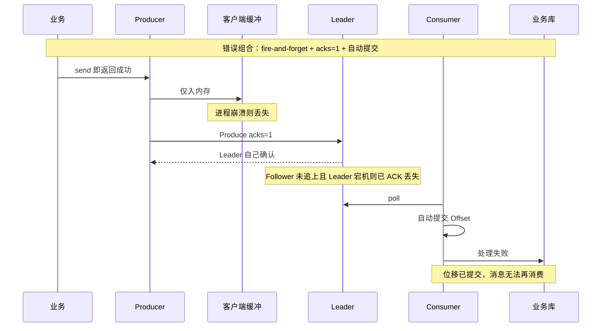
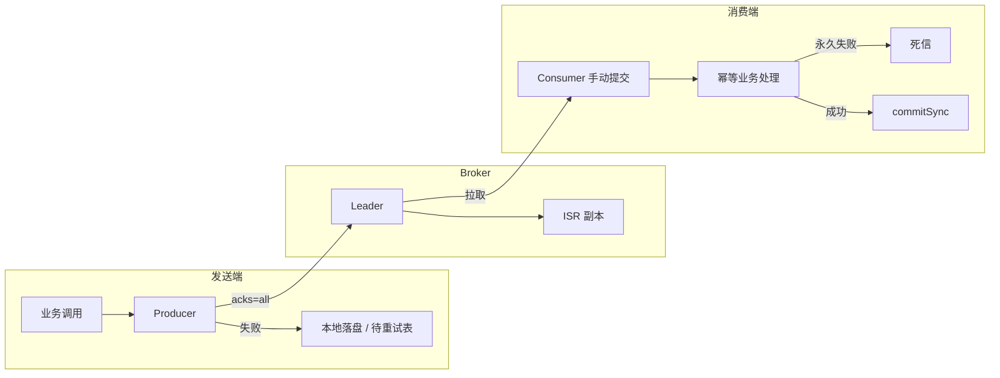
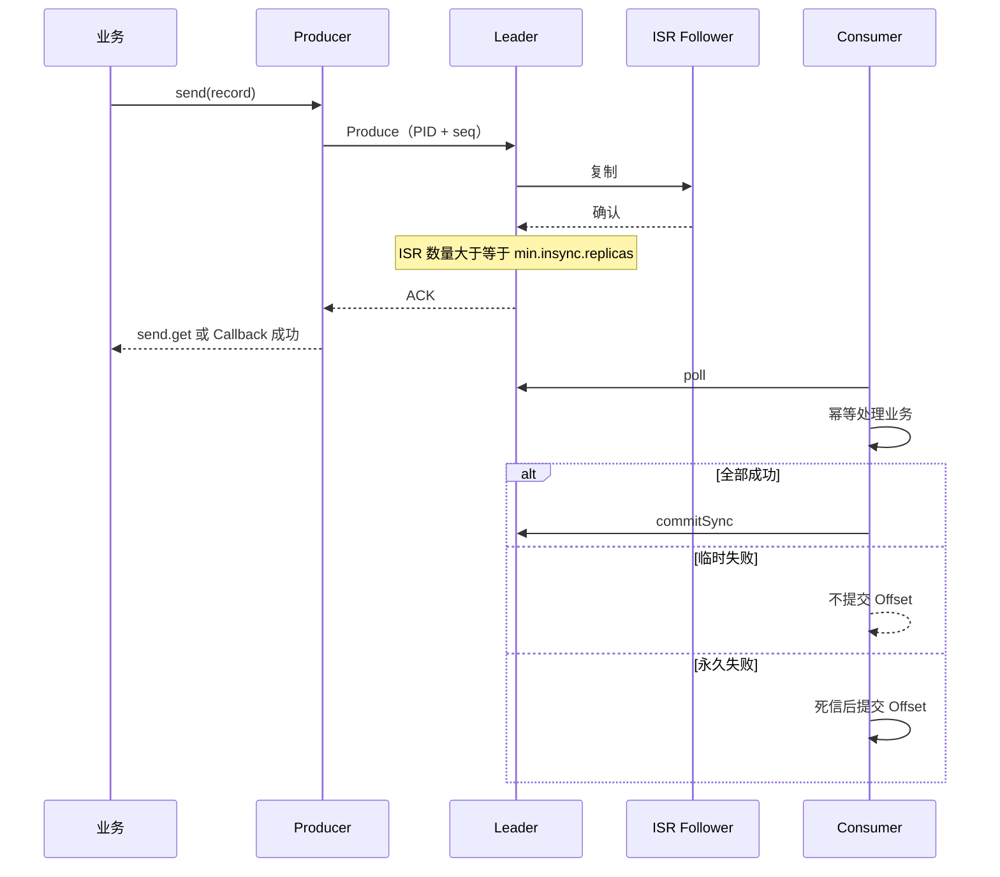
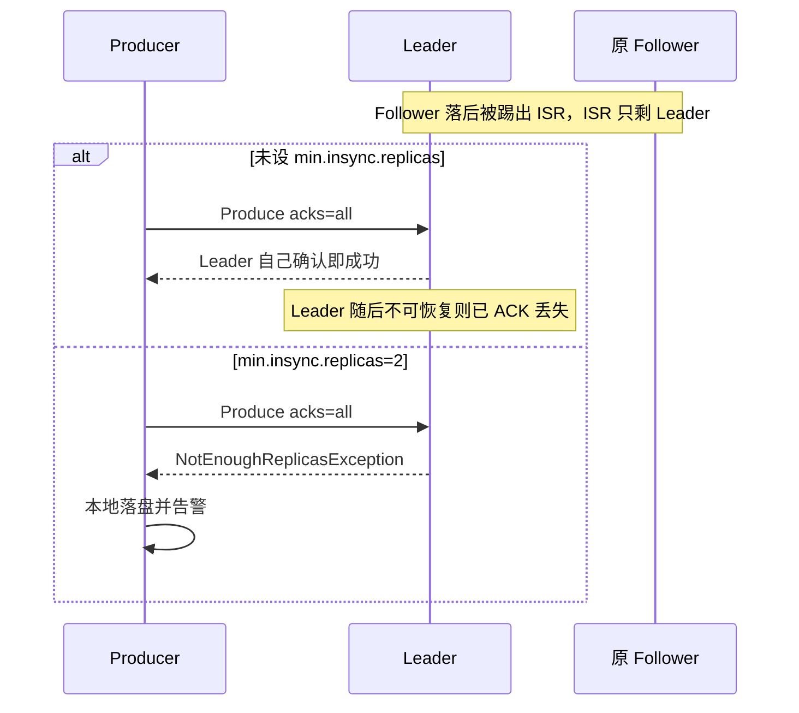

## 1. 背景与目标

### 1.1 一句话概括

面向「业务消息一旦发出就不能在链路中静默丢失」的场景，把可靠性拆成发送端、Broker、消费端三环：Producer 必须以 Broker 确认作为成功判据并在失败时本地落盘；Broker 以多副本 + ISR 阈值保证已确认数据可恢复；Consumer 必须先完成业务处理再提交位移。三环同时成立才构成端到端「不丢失」防线；幂等与事务用来消化重试带来的重复，而不是替代确认机制。

### 1.2 背景与目标

| 维度 | 说明 |
|------|------|
| 场景 | 订单、库存、资金指令等不可静默丢单 |
| 痛点 | 只调高副本数、或只开幂等 Producer，仍会在 ACK 未完成、ISR 萎缩、先提交后处理等窗口丢数据 |
| 目标 | 可检查的端到端不丢失：成功有据、失败可补偿、重复可幂等 |
| 约束 | 默认 At-Least-Once；跨分区 / 跨 Producer 会话的精确一次需事务或业务键，本文默认方案未展开事务代码 |

### 1.3 适用与不适用

| 适用 | 不适用 |
|------|--------|
| 资金、订单、库存等不可静默丢单，发送失败必须落盘 | 只开幂等生产者却要求跨分区全局去重 |
| 同分区允许重复、用业务 ID 去重 | Producer 崩溃后仍要求 Broker 识别「同一条业务消息」（PID 已变） |
| `replication.factor>=3` 且 `min.insync.replicas=2` 抗单机宕机 | 必须跨系统 Exactly-Once（写库 + 发消息），本文未设计 Outbox |
| 临时失败不提交、永久失败进死信 | ISR 长期不足仍要求持续可写（会 `NotEnoughReplicasException`） |
| | 极高吞吐且不能接受保序用的 `max.in.flight.requests.per.connection=1` |

### 1.4 技术栈

| 层次 | 技术 |
|------|------|
| 消息中间件 | Apache Kafka（Broker + Topic 级副本） |
| 客户端 | Java `Producer` / `Consumer` |
| 发送确认 | 同步 `send().get(timeout)` 或异步 Callback |
| 发送幂等 | `enable.idempotence`（PID + 分区序列号） |
| 跨会话 / 跨分区精确一次 | Kafka Transaction + 固定 `transactional.id`（仅点到，无实现细节） |
| 消费提交 | `enable.auto.commit=false` + `commitSync` |
| 消费幂等 | Redis `SET NX` 或数据库唯一键 |
| 发送失败兜底 | 本地文件 / 待重试表 / Redis + 告警 |

### 1.5 核心设计思想

- **确认即契约**：`send` 入缓冲不算成功，只有 Broker ACK（`get` 返回或 Callback 无异常）才算。
- **确认深度可强制**：`acks=all` 等 ISR 全部确认；`min.insync.replicas` 防止 ISR 只剩 Leader 时退化成等价 `acks=1`。
- **可用性服从已确认完整性**：`unclean.leader.election.enable=false`，宁可短暂不可写，也不用落后副本截断已 ACK 数据。
- **At-Least-Once + 业务幂等**：先处理再提交；业务唯一 ID 去重。幂等 Producer 只管同分区同会话。
- **Broker 不可用时堆外兜底**：异常落盘 + 告警，避免消息只活在进程内存里。

---

## 2. 错误路径与根因

### 2.1 典型「以为不丢、其实会丢」对照



### 2.2 错误代码特征

```java
// ❌ 发送：未等待 ACK，异常被吞
producer.send(record);
order.setSent(true); // 缓冲里的消息被当成已投递

// ❌ 消费：自动提交，处理结果与位移解耦
props.put("enable.auto.commit", "true");

// ❌ 消费：catch 后再 finally 无条件提交，处理失败也会推进位移
try {
    processBatch(records);
} catch (Exception e) {
    log.error("consume failed", e);
} finally {
    consumer.commitSync(); // 可能提交未处理完的批次
}
```

```java
// ❌ Redis NX 成功后写库失败：重试时 Redis 已存在，业务未入账却被跳过
Boolean first = redis.opsForValue()
    .setIfAbsent("processed:" + orderId, "1", 10, TimeUnit.MINUTES);
if (Boolean.FALSE.equals(first)) {
    return true; // 视为已处理
}
orderDao.insert(order); // 失败返回 false → 不提交 Offset
// 下次 poll：Redis 命中，直接 return true，库中仍无订单
```

### 2.3 根因链

| 步骤 | 机制 | 后果 |
|------|------|------|
| 1 | `Producer.send` 只入客户端缓冲 | 进程退出则未 ACK 消息消失 |
| 2 | 仅 `acks=all`、ISR 缩到 1 | 确认深度退化为只写 Leader，Leader 不可恢复则丢已 ACK |
| 3 | unclean Leader 选举 | 落后副本当选，高水位回退，已确认数据被截断 |
| 4 | `enable.auto.commit=true` 或先 `commit` 后处理 | 业务失败后位移不可回退 |
| 5 | 幂等 Producer 被当成 Exactly-Once | PID 随进程重启变化，跨会话重复写入 Broker |
| 6 | 去重键用 Offset / MsgID 或短 TTL Redis | 重试身份变化或窗口外再投递，挡不住重复或误挡未入账 |

### 2.4 次要问题

| 问题 | 说明 |
|------|------|
| `retries=Integer.MAX_VALUE` 被理解成永不失败 | 仍受 `max.block.ms`、`get(10s)` 等限制；与 `delivery.timeout.ms` 如何叠加本文未展开，需按所用客户端版本核对 |
| 批提交 `max.poll.records=500` | 第 1 条失败最多重放 500 条，下游与幂等存储被放大 |
| 刷盘语义 | ACK 返回不等于一定已落物理磁盘；本文未论证 page cache / flush |

---

## 3. 方案设计

### 3.1 整体架构



### 3.2 正确链路时序



### 3.3 ISR 萎缩时「有 minISR」vs「无 minISR」



### 3.4 发送端配置与成功判据

| 配置键 | 推荐值 | 作用 |
|--------|--------|------|
| `acks` | `all` | 等待 ISR 全部确认 |
| `retries` | `Integer.MAX_VALUE` | 尽量由客户端内部重试 |
| `retry.backoff.ms` | `1000` | 重试间隔 |
| `max.block.ms` | `60000` | 阻塞上限 |
| `enable.idempotence` | `true` | 同分区、同会话重试时 Broker 去重 |
| `max.in.flight.requests.per.connection` | `1`（严格保序时） | 限制未确认请求，避免重试乱序 |

成功判据：`producer.send(record).get(10, TimeUnit.SECONDS)` 得到 `RecordMetadata`，或 Callback 中 `exception == null`。10 秒是示例超时，不是 Broker SLA。

失败必须：本地落盘（文件 / 待重试表 / Redis）→ 告警 → 补偿任务定期重试。补偿必须幂等，否则与客户端重试、跨会话重发叠加。

```java
// ✅ 等待 ACK；失败离开堆内存
public void sendMessage(ProducerRecord<String, String> record) {
    try {
        RecordMetadata metadata = producer.send(record).get(10, TimeUnit.SECONDS);
        log.info("sent ok, offset={}", metadata.offset());
    } catch (Exception e) {
        log.error("kafka send failed, persist locally", e);
        saveToLocalDisk(record);
        alertService.sendAlert("kafka send error", e.getMessage());
    }
}
```

### 3.5 幂等生产者：同分区、同会话

| 组件 | 说明 |
|------|------|
| PID | 启动时 Broker 分配，**当前进程存活期间**有效；重启获得新 PID |
| Sequence Number | 每个 `<PID, Topic, Partition>` 从 0 单调递增 |
| Broker | 维护「预期下一个序列号」 |

去重：首次 seq=0 且预期为 0 → 写入，预期变为 1；重试仍带 seq=0 → 视为重复，丢弃并返回成功 ACK。

限制：跨分区无全局去重；跨会话无法去重（已成功但 ACK 丢失 → 进程重启 → 业务再发会写成两条）。跨分区 / 跨会话精确一次需固定 `transactional.id` 的事务。事务协调者、隔离级别、`transaction.timeout.ms` 本文未展开。

### 3.6 Broker 黄金组合

Topic 示例：`partitions=3`，`replication-factor=3`，`min.insync.replicas=2`。Broker：`unclean.leader.election.enable=false`。

| 概念 | 定义 |
|------|------|
| ISR | 与 Leader 同步的动态副本集合；超过 `replica.lag.time.max.ms` 则踢出 |
| Leader 选举 | 只允许 ISR 内副本参选 |
| `min.insync.replicas` | ISR 数量低于阈值则拒绝写入，抛 `NotEnoughReplicasException` |
| 与 `acks=all` | `acks=all` 等**当前 ISR 全部**确认；minISR **强制 ISR 不得过小** |

| 配置 | 推荐值 | 原理 |
|------|--------|------|
| `replication.factor` | `>=3` | 1 Leader + 2 Follower，允许 1 台宕机仍有冗余 |
| `min.insync.replicas` | `2` | 至少 Leader + 1 Follower；一台宕机后 ISR 仍可能为 2 从而可写 |
| `unclean.leader.election.enable` | `false` | 禁止落后副本当选 |

```properties
bootstrap.servers=broker-1:9092,broker-2:9092,broker-3:9092
acks=all
retries=2147483647
retry.backoff.ms=1000
max.block.ms=60000
enable.idempotence=true
max.in.flight.requests.per.connection=1
unclean.leader.election.enable=false
```

```bash
kafka-topics.sh --create \
  --bootstrap-server broker-1:9092 \
  --topic order-event-topic \
  --partitions 3 \
  --replication-factor 3 \
  --config min.insync.replicas=2
```

ISR 不足时应监控 ISR 大小与 `NotEnoughReplicasException`，不要把 minISR 临时降到 1 来「恢复写入」。

### 3.7 消费端：先处理再提交

| 配置键 | 值 | 作用 |
|--------|-----|------|
| `enable.auto.commit` | `false` | 业务掌握提交时机 |
| `auto.offset.reset` | `earliest` | 首次或位移失效从最早开始 |
| `max.poll.records` | `500` | 单次拉取条数，按业务调整 |
| `group.id` | `group-order-prod`（示例） | 消费组 |

| 提交粒度 | 实现 | 优点 | 缺点 | 适用 |
|----------|------|------|------|------|
| 每条 | 一条一 `commitSync` | 最精确 | 性能极差 | 极严苛 |
| 批量（推荐） | 一批后提交 | 吞吐与可靠性平衡 | 失败最多重复 N 条 | 绝大多数 |
| 分区 | 按 `TopicPartition` 提交 | 并行更细 | 实现较复杂 | 多分区并行 |

临时异常（如 DB 超时）不提交；永久异常（如 JSON 无法解析）进死信后提交，避免毒丸堵死分区。幂等必须基于业务唯一 ID（如 `order_id`），不能依赖 Offset 或 MsgID。

```java
// ✅ 整批成功才提交；异常路径不提交
ConsumerRecords<String, String> records = consumer.poll(Duration.ofMillis(1000));
for (ConsumerRecord<String, String> record : records) {
    if (!processIdempotently(record)) {
        handleFailure(record); // 临时：不提交；永久：死信后对本条提交
        return;
    }
}
consumer.commitSync();
```

实施时必须避免：`finally` 无条件 `commitSync`；以及 Redis NX 与 DB 写入非原子导致「标记已处理但未入账」。资金类应以数据库唯一约束为权威。`max.poll.interval.ms`、`session.timeout.ms` 与批耗时的匹配本文未配，处理过慢会再均衡并重复投递。

待重试表仅有原则、无 DDL；补偿状态机需在实施时补齐。

---

## 4. 关键设计选择及原因

### 4.1 以 Broker ACK 而非「send 返回」作为发送成功

| 原因 | 说明 |
|------|------|
| 契约清晰 | `send` 本质是入缓冲；未确认前消息仍可能在内存 |
| 与重试闭环 | 只有失败路径可触发落盘 |
| 可观测 | `RecordMetadata.offset` 可作为对账锚点 |

**备选方案**：fire-and-forget / 只打日志不 wait → **放弃原因**：无法构成不丢失；进程崩溃即丢缓冲。

### 4.2 `acks=all` 且必须搭配 `min.insync.replicas`

| 原因 | 说明 |
|------|------|
| 堵住退化 | 仅 `acks=all` 时 ISR 缩到 1，确认深度等于只写 Leader |
| 失败可感知 | ISR 不足时拒绝写入，应用走落盘，而不是静默单副本确认 |

**备选方案**：`acks=1` 换吞吐 → **放弃原因**：Leader 在 Follower 追上前宕机，已 ACK 消息可能丢失。

### 4.3 `replication.factor>=3` 且 `min.insync.replicas=2`

| 原因 | 说明 |
|------|------|
| 故障容量 | 允许一台 Broker 故障仍可能保持可写（ISR 仍可能为 2） |
| 确认下限 | 成功写入至少两副本 |

**备选方案**：副本 2 + minISR 2（无故障余量）或 minISR=1 → **放弃原因**：前者一台故障即不可写；后者达不到确认深度。

### 4.4 `unclean.leader.election.enable=false`

| 原因 | 说明 |
|------|------|
| 完整性优先 | 非 ISR 副本可能缺已确认消息，当选等于截断已 ACK 数据 |
| 与「不丢失」一致 | 短暂不可用可接受，数据回退不可接受 |

**备选方案**：允许 unclean 选举换快速恢复 → **放弃原因**：直接破坏已确认不丢失。

### 4.5 开启幂等生产者，但不冒充跨会话 Exactly-Once

| 原因 | 说明 |
|------|------|
| 覆盖主路径 | 网络抖动导致的同 PID 重试，Broker 可去重 |
| 边界诚实 | PID 绑定进程；重启后业务重发会重复，必须业务幂等或事务 |

**备选方案**：关闭幂等、只靠消费去重 → **放弃原因**：Broker 上产生重复消息，放大存储与消费压力。  
**备选方案**：所有链路一律上 Kafka 事务 → **放弃原因**：事务有额外延迟与协调成本；定位为跨分区 / 跨会话增强，非默认全开。

### 4.6 严格保序时 `max.in.flight.requests.per.connection=1`

| 原因 | 说明 |
|------|------|
| 避免乱序 | 多 inflight 时先发批次失败重试，可能排到后发批次之后 |

**备选方案**：inflight>1 换吞吐（开启幂等后客户端对 inflight 上限有约束，**具体上限本文未写**）→ **放弃原因**：与严格保序冲突时选 inflight=1。

### 4.7 消费关闭自动提交 + 批量 `commitSync`

| 原因 | 说明 |
|------|------|
| 防止业务失败已提交 | 自动提交按时间推进位移，与处理结果解耦 |
| 同步提交可感知失败 | `commitSync` 失败可捕获；同步提交为最稳妥 |

**备选方案**：自动提交 + 缩短间隔 → **放弃原因**：窗口内仍可能「已提交未处理」。  
**备选方案**：每条提交 → **放弃原因**：性能不可接受，仅极严苛场景使用。

### 4.8 消费幂等用业务 ID，不用 Offset / MsgID

| 原因 | 说明 |
|------|------|
| 重试身份变化 | 重试消息 MsgID 可能不同 |
| 跨会话重复 | 新 PID 下 Broker 视为新消息，只有业务键能识别 |

**备选方案**：仅 Redis 短 TTL 去重 → **放弃原因**：TTL 过期后重复消费会再次执行；资金类更宜唯一约束。Redis 标为高性能、DB 唯一键标为更可靠，**未强制只用哪一种**。

### 4.9 发送失败本地落盘 + 告警，而不是无限阻塞业务线程

| 原因 | 说明 |
|------|------|
| 堆外持久 | Kafka 长期不可用时，仅靠 `retries=MAX` 仍可能在超时后失败 |
| 人机协同 | 告警保证补偿失败可被发现 |

**备选方案**：发送失败直接抛给上游（HTTP 500）→ **可并存**：若上游也不落盘仍可能丢。落盘是最后兜底。  
**备选方案**：Outbox 同库事务先写再发 → **本文未采用**（未描述）；对不丢失通常更强，但改造面更大。

---

## 5. 风险与应对

| 风险 | 应对 |
|------|------|
| ISR 萎缩，acks=all 退化 | `min.insync.replicas=2`，不足则拒绝写入 |
| Unclean 选举丢已确认数据 | `unclean.leader.election.enable=false` |
| 发送成功未收到 ACK，进程重启重复写 | 幂等生产者不够；业务幂等或事务 |
| Kafka 整体不可用 | 本地落盘 + 告警 + 补偿 |
| 自动提交导致未处理消息被确认 | `enable.auto.commit=false` |
| 批提交失败重放 N 条 | 业务幂等；N 受 `max.poll.records`（示例 500）约束 |
| 毒丸消息卡死分区 | 永久失败进死信后提交 Offset |
| Redis 去重与 DB 写入非原子 | 单源去重或先持久化业务再记去重 |
| `finally` 误提交 | 异常路径禁止提交未完成批次 |
| 跨分区「精确一次」期望过高 | 事务或业务层去重，不要只靠幂等 Producer |
| 无限 retries 仍失败 | 有 `max.block.ms` 与 `get(10s)`；勿把 retries 最大值理解成永不放弃 |

---

## 6. 测试要点

| 优先级 | 用例 |
|--------|------|
| P0 | `acks=all` + minISR=2：停一台 Follower，生产仍成功；再停一台使 ISR&lt;2，生产失败并走落盘 |
| P0 | 模拟 Produce 超时 / 断连：业务不得将未 ACK 记为成功 |
| P0 | 消费处理抛临时异常：重启后同一消息再次处理 |
| P0 | 先提交后处理的错误实现：注入处理失败，断言消息不可恢复（反例） |
| P0 | 唯一键冲突：重复消息不产生重复业务单据 |
| P1 | 拦截 ACK 触发客户端重试：同分区 Broker 侧无脏重复（或消费去重计数为 0） |
| P1 | Producer 重启后再发同一业务单：Broker 可能两条；消费幂等后业务结果一条 |
| P1 | JSON 损坏：进入死信且位移前进，后续消息不被阻塞 |
| P1 | 关闭前 `commitSync`：只提交已处理位移，禁止「异常后 finally 仍提交」 |
| P2 | inflight=1 下分区内顺序（若业务声明保序） |
| P2 | 事务路径（若启用）：跨会话不重复；无实现前标 N/A |

---

## 7. 深度剖析：技术负责人视角问答

> 共 13 题。定位：考核高级 / 资深后端。客户端未写明的超时叠加关系标为「本文未展开」。

### Q1：为什么「不丢失」必须是三环同时成立，而不是把副本数加到 5 就够了？

**考察点**：端到端故障模型；避免单点迷信中间件。

**答**：

#### 结论
副本只保护「已经被 Broker 按约定确认过的数据」。发送端没等到 ACK、或消费端先提交后处理失败，副本再多也补不回应用内存里的消息或已经跳过的位移。

#### 背景与原理
消息生命周期分三段：客户端缓冲 → 分区持久化与复制 → 消费者处理与位移。每一段有独立失败模式：进程杀、Leader 切换、ISR 萎缩、处理超时、再均衡。中间件无法看见「业务是否处理成功」。

#### 结合本方案
成功定义为：Producer 收到 ACK；Broker 在 `acks=all` 且 ISR≥`min.insync.replicas` 下复制；Consumer `enable.auto.commit=false` 且处理后再 `commitSync`。缺发送落盘，Broker 长时间不可用时消息停在堆上；缺手动提交，自动提交窗口内会出现「位移超前、业务失败」。

#### 边界与权衡
三环保证的是 At-Least-Once 下的不丢失，默认用幂等消化重复。若业务不能容忍重复且不能做幂等，需要事务或 Outbox，超出本文默认范围。

#### 追问
「只加强 Broker、Producer 用 acks=0 行不行？」——不行，那是主动放弃发送确认，与第一环原则相反。

---

### Q2：只有 `acks=all`、不设 `min.insync.replicas`，在什么故障下会丢已确认消息？

**考察点**：ISR 动态性与确认深度退化。

**答**：

#### 结论
当 ISR 因落后或宕机缩小到只剩 Leader 时，`acks=all` 只需 Leader 自己确认即可返回成功；随后 Leader 磁盘 / 进程不可恢复，Follower 又从未包含这条消息，已 ACK 数据可能消失。

#### 背景与原理
`acks=all` 的语义是「当前 ISR 集合全部确认」，不是「永远至少 N 个副本」。ISR 是动态的，`replica.lag.time.max.ms` 会把慢副本踢出。

#### 结合本方案
因此必须 `min.insync.replicas=2`：ISR 小于阈值时直接 `NotEnoughReplicasException`，让发送端走失败与落盘。黄金组合把二者写成缺一不可。

#### 边界与权衡
minISR 提高了「拒绝写入」概率。这是用失败换数据完整性。集群长期 ISR 不足应修副本与磁盘，而不是把 minISR 调回 1。

#### 常见误区
以为 `acks=all` 永远等于「全部物理副本」——副本总数与 ISR 当前成员不是同一集合。

#### 追问
replication-factor=3 且 minISR=3 的读写可用性如何？——任意一台故障即不可写，推荐 minISR=2 是在冗余与可写之间取值。

---

### Q3：`unclean.leader.election.enable=false` 时，运维说「分区一直选不出 Leader，先改 true 应急」，你批不批？

**考察点**：线上应急是否允许破坏已确认完整性。

**答**：

#### 结论
按本方案目标，**不批**把 unclean 打开作为常规应急。那是用落后副本当 Leader，可能丢掉 ISR 上已确认、落后副本没有的数据。

#### 背景与原理
Unclean 的「脏」是指新 Leader 的高水位可能低于原 ISR Leader，消费者已读或 Producer 已 ACK 的偏移在新 Leader 上不存在。

#### 结合本方案
宁可暂时不可用，也不丢失已确认消息。应急应优先恢复原 ISR 成员、修网络 / 磁盘、从健康副本重启。

#### 边界与权衡
若业务明确「可丢少量已确认换恢复」，那是改 SLA，必须产品签字，且不能再宣称本方案的不丢失级别。即使临时打开，也要事后审计缺口偏移并补数。

#### 追问
如何证明当前 ISR 为空是「所有副本都挂」还是「只是注册信息延迟」？——查控制器 / 分区状态与副本日志末端偏移（具体命令以官方运维工具为准）。

---

### Q4：幂等生产者能否替代消费幂等？给出会重复的具体时序。

**考察点**：PID 生命周期；At-Least-Once 与 EOS 边界。

**答**：

#### 结论
不能替代。幂等只覆盖**同一 PID、同一分区、序列号重试**。进程重启或跨分区，Broker 会当作新消息；消费仍可能收到重复，必须业务去重或事务。

#### 背景与原理
Broker 去重键是 `<PID, Topic, Partition, seq>`。新 PID 的 seq 从 0 再计，与旧消息无关联。

#### 结合本方案
跨会话：发送已成功但 ACK 丢失 → 进程宕机 → 新 PID → 业务再 `send` 同一业务单 → Broker 无法识别重复。消费侧要求基于 `order_id` 一类业务键，不要用 MsgID。

#### 边界与权衡
事务 + `transactional.id` 可跨会话恢复 PID 状态，本文仅点名、无代码。即使 EOS 读 Kafka 内部状态，写外部 DB 仍要幂等或 Outbox。

#### 追问
同分区但发到两个不同 topic 的「同一订单」去不去重？——幂等 Producer 按 topic+partition 独立，不能当全局订单锁。

---

### Q5：为什么严格保序要把 inflight 打到 1？吞吐不够时你怎么和产品谈？

**考察点**：顺序、重试与流水线的权衡。

**答**：

#### 结论
多请求在途时，先发送批次若失败重试，可能在分区日志中排到后发送批次之后，造成分区内乱序。用 inflight=1 消除该窗口。若业务其实只需要「同 key 有序」，应先确认分区策略（同一 key 同分区）再决定是否全局 inflight=1。

#### 背景与原理
分区内顺序由追加日志位置决定，不等于「客户端发送调用顺序」在重试下仍保持。

#### 结合本方案
inflight=1 是「如果业务要求严格保序」时的选项，不是 Broker 黄金三项里的必选项。

#### 边界与权衡
inflight=1 降低流水线，延迟上升。可谈替代：按业务键分区 + 幂等开启后使用客户端允许的更大 inflight（**上限数值本文未写**）、或接受短暂乱序由消费端按业务时间戳排序。不能既要峰值吞吐又要全局严格序还不增加分区与实例。

#### 追问
「开启幂等后 Kafka 是否保证乱序重试不再发生？」——不要在未核对的版本细节上拍板；以官方对应版本客户端文档为准，本文采取最保守 inflight=1。

---

### Q6：发送失败落盘补偿，和 Kafka 事务 / 发件箱（Outbox）比，为什么还保留落盘？什么时候必须升级？

**考察点**：工程权衡；防护优先级。

**答**：

#### 结论
落盘是在「现有 send API 不变」下，对 Broker 不可用与客户端超时时的最后兜底，改造成本低于全链路 Outbox。若业务与消息必须同事务（扣库存与发消息要么都成功要么都失败），应升级 Outbox；本文**未设计**该升级路径。

#### 背景与原理
本地文件与业务库通常不在一个事务里：可能「库已提交、落盘失败」或相反，补偿任务会重复发送，故消费必须幂等。

#### 结合本方案
落盘 + 告警解决的是「消息不停留在内存」，不解决跨会话 Broker 去重。

#### 边界与权衡
落盘若是单机磁盘，所在机挂掉仍可能丢未同步文件——可写 DB / Redis，可靠性取决于该存储的 HA。补偿任务的投递语义、去重键需在实施时补齐。

#### 追问
落盘与 `retries=MAX` 是否重复？——不重复：内部重试覆盖短抖动；落盘覆盖重试耗尽或进程将死。

---

### Q7：消费组反馈「订单偏多」，如何在 2 小时内定责：丢了、重了、还是重复投递未幂等？

**考察点**：线上 triage；口径与证据。

**答**：

#### 结论
先区分「Kafka 里有没有」和「业务表有没有」。偏多通常是 At-Least-Once 重复未挡住，不是「不丢失」失败；偏少才走丢失三环排查。

#### 背景与原理
丢失：ACK 未完成却当成功、ISR 退化、先提交后处理、自动提交。重复：Producer 跨会话重发、批失败重放、再均衡、补偿任务与原发送双发。

#### 结合本方案
建议顺序：

1. 用业务 ID 查生产日志是否有 `offset` 成功日志。
2. 查消费是否多次「已处理过，跳过」（有跳过说明重复到达但应被挡住；无跳过却有多条业务行，去重键失效）。
3. 查 `enable.auto.commit` 是否被环境配置覆盖。
4. 查 ISR / minISR 与 `NotEnoughReplicas` 是否被上游当成成功。
5. 查补偿表是否与在线发送并行且无幂等。

#### 边界与权衡
没有业务唯一键就无法在消费侧结案，只能数 Kafka 消息条数，条数偏多不代表事故。

#### 常见误区
「Broker ACK 了就一定消费一次」——消费失败重试会多次。

#### 追问
如何证明某 offset 对应哪张业务单？——发送日志应带业务 ID + topic + partition + offset；若示例只打了 offset，生产实施应补业务 ID，否则对账困难。

---

### Q8：Code Review：消费循环 `catch` 后 `finally { commitSync() }` 这 PR 你合不合？

**考察点**：位移提交正确性。

**答**：

#### 结论
**不合**（按该控制流的字面含义）。它与「异常不提交」直接矛盾，可能把未处理或部分处理批次的位移提交，造成丢失。

#### 背景与原理
未指定 map 时，`commitSync` 默认提交上次 poll 的全部位移。处理循环中途失败时，这些位移对应的消息并未全部成功。

#### 结合本方案
应要求：正常批次结束才提交；关闭仅提交**已成功处理**的位移；或关闭时不提交并接受重复消费（由幂等消化）。死信路径才允许对毒丸提交。

#### 边界与权衡
「关闭前提交以免重复」是体验优化，不能压过不丢失。可接受的已知不完美是重复而不是丢失。

#### 追问
分区粒度提交能否只提交失败点之前？——可以，按 `TopicPartition` 提交，但要实现「处理到哪记到哪」。

---

### Q9：Redis `SET NX` 10 分钟 TTL 做消费去重，资金类能不能过设计评审？

**考察点**：幂等存储的时效与正确性。

**答**：

#### 结论
作为唯一防线**不能过**资金类评审。TTL 过后同一消息再投递会再次执行；Redis 与 DB 非原子时还会出现「标记已处理但未入账」。资金类应以数据库唯一约束（或等价持久去重表）为权威。

#### 背景与原理
去重集合必须覆盖「重复可能到达的时间窗」。Kafka 重放、补偿延迟、人工重推都可能超过 10 分钟。

#### 结合本方案
Redis 标为高性能、DB 唯一键标为更可靠。若把两种方式串联，且 Redis 成功后写库失败返回 false，重试会被 Redis 短路——这是比 TTL 更严重的正确性缺陷。

#### 边界与权衡
高 QPS 非资金可用 Redis，但要定义 TTL≥最大重试窗口，并接受窗口外重复的业务后果。或 Redis 仅作加速、以 DB 为准（先插库再缓存）。

#### 追问
唯一键冲突是否可能「不同业务事件共用 order_id」？——若会，去重会误伤，键必须包含事件类型 + 版本。

---

### Q10：批大小 500 时，失败重放对下游的放大如何估？如何选 `max.poll.records`？

**考察点**：定量与容量。

**答**：

#### 结论
最坏情况下，一批中第 1 条失败会导致最多 500 条重复投递。下游 QPS 与幂等存储压力按「失败率 × 批大小」放大。批不是越大越好。

#### 背景与原理
位移是分区上的单调下标，提交点之前的全部消息在重放下都会回来（同一分区）。

#### 结合本方案
`max.poll.records=500` 是推荐起点。处理耗时还受 poll 间隔约束（**具体 timeout 本文未配**）：批太大导致处理超过 max poll interval 会再均衡，放大重复。

#### 边界与权衡
每条提交则 N=1，CPU 与 Broker 提交放大。可折中：按 50～100 或按耗时预算反推：`批大小 × 单条耗时 << 再均衡超时`。

#### 追问
多分区一次 poll 混合失败怎么算 N？——应对失败分区不提交、成功分区提交；整批一个 `commitSync` 会把多分区绑在一起。

---

### Q11：集群只剩两台 Broker 时，本方案是继续写还是停写？依据是什么？

**考察点**：容量降级；原则 vs 临时配置。

**答**：

#### 结论
在 `replication.factor=3` 且 `min.insync.replicas=2` 下，两台存活**有可能**仍可写（ISR 仍能凑到 2），但已无「再挂一台仍冗余」的余量；若 ISR 因落后掉到 1，应**停写**（拒绝 Produce），发送端落盘，而不是改 minISR。

#### 背景与原理
可写条件是当前 ISR 数量 ≥ minISR，不是「集群 Brokers 台数 ≥ 3」。

#### 结合本方案
黄金组合允许「1 台宕机仍可能可用」。第二台再出问题或副本追不上，应告警与落盘。把 minISR 改为 1 等于回到 Q2 的退化路径。

#### 边界与权衡
若业务选择「降级写入保营业」，必须承认可能丢已确认数据，退出本方案承诺。一开始只部署两 Broker 就不满足 replication-factor=3 的硬件前提。

#### 追问
优先缩分区副本数还是优先扩 Broker？——应扩 Broker 恢复三副本，而不是把已有分区副本数降到 2 长期运行。

---

### Q12：若 PR 把 `enable.idempotence` 关掉但保留 `acks=all` 和手动提交，你如何批？

**考察点**：设计原则被违背时的 Review 决策。

**答**：

#### 结论
**要求改回或给出可接受重复的书面范围**。关幂等不会立刻导致「丢失」，但同分区重试会在 Broker 上产生重复消息，增加存储与消费重复率。除非有版本兼容等硬约束，否则不应为了「少一个配置」关闭。

#### 背景与原理
幂等与 acks=all、retries 在客户端是配套关系。关闭后，发送端超时重试对 Broker 是两条记录。

#### 结合本方案
消费幂等仍需要，但不能作为关闭 Producer 幂等的理由——重复应尽量在源头抑制。

#### 边界与权衡
极旧客户端不支持幂等时，必须加强消费唯一约束与补偿去重，并在文档中降级承诺。新客户端无理由关闭。

#### 追问
「幂等导致内存占用 / PID 注册失败」是否构成关闭理由？——先查 Broker 与客户端日志，调超时与连接，而不是关幂等。

---

### Q13：要从本方案演进到「跨会话不重复写入 Kafka」，最小改动是什么？哪些问题它仍解决不了？

**考察点**：演进扩展；事务边界。

**答**：

#### 结论
最小中间件向演进是：固定 `transactional.id` 的 Kafka 事务，让 PID 状态可恢复，从而跨会话对 **Kafka 日志** 去重。它仍解决不了「数据库提交与发消息」的跨系统原子性，也解决不了消费侧写库的 Exactly-Once，除非再上事务消费或 Outbox。

#### 背景与原理
事务协调者持久化事务状态；`transactional.id` 使新进程 fence 旧 Producer，避免僵尸进程双写。

#### 结合本方案
启用后 Producer 从「send+get」变为事务边界，失败回滚与落盘补偿要重新设计，避免事务回滚后又被落盘重发。隔离级别、超时、消费 `read_committed` 均待按版本确认。

#### 边界与权衡
事务增加延迟与协调失败面。若重复只会发生在应用层（同一订单号），强化 DB 唯一键可能比全站开事务更便宜。应先问：重复不可接受的是 Kafka 日志还是业务事实？后者优先业务约束。

#### 追问
开启事务后还要不要消费幂等？——要。再均衡、批失败、死信重投仍会 At-Least-Once 到业务。

---

## 8. 团队规范沉淀

1. **发送成功只认 ACK**：禁止 fire-and-forget；失败必须落盘并告警，补偿任务必须带业务幂等键。
2. **Broker 黄金三项一起上**：`replication.factor>=3`、`min.insync.replicas=2`、`unclean.leader.election.enable=false`；禁止用降 minISR / 开 unclean 当常规应急。
3. **消费铁律**：`enable.auto.commit=false`，先处理再 `commitSync`；异常路径禁止 `finally` 提交整批位移。
4. **幂等分层**：Producer 幂等只覆盖同分区同会话；跨会话 / 跨分区靠业务 ID 或事务；资金类以 DB 唯一约束为权威，Redis TTL=10 分钟不得作为唯一防线。
5. **对账日志**：成功路径必须打业务 ID + topic + partition + offset，否则线上「偏多 / 偏少」无法在 2 小时内定责。

---

## 9. 小结

> **发送端要收到明确的成功确认，服务端要有足够多的副本确认，消费端要先处理业务再提交确认。** 三环缺一不可。幂等生产者不是 Exactly-Once；`acks=all` 没有 minISR 会在 ISR 萎缩时退化；示例里的 `finally commitSync` 与 Redis+DB 串联去重会在「宣称不丢失」的同时引入静默丢处理。不要把 `retries` 取最大值理解成数学上的永不失败。
