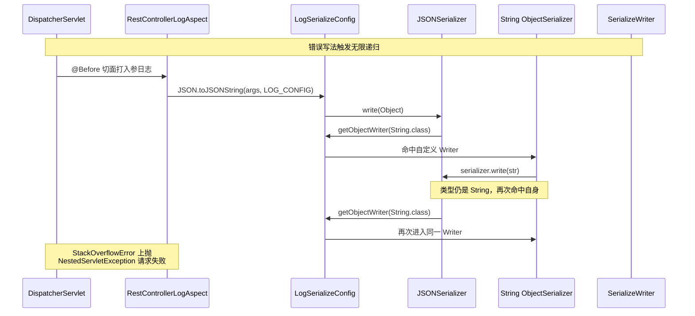
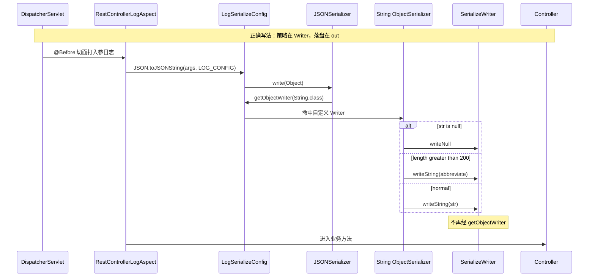
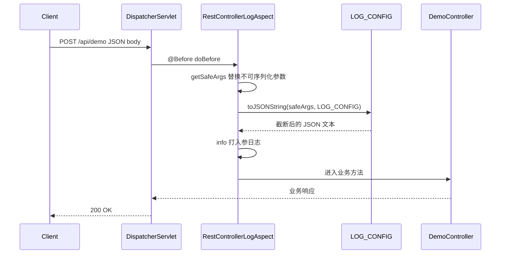
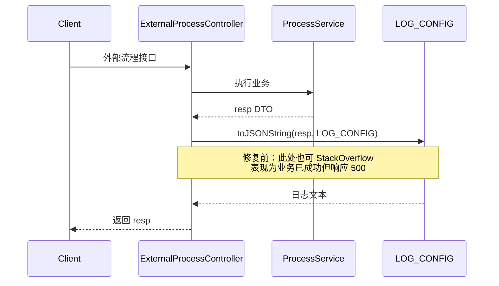

## 1. 案例概述

### 1.1 一句话概括

`@RestController` 入参日志通过独立 `SerializeConfig` 对 String 做长度截断时，自定义 String Writer 内部错误调用了 `serializer.write(String)`，按类型再次选中同一 Writer，无限递归为 `StackOverflowError`；该类属于 `Error`，切面仅 `catch Exception` 拦不住，请求整链路失败。修复为写入 `SerializeWriter`（`out.writeString`），并扩大切面捕获为 `Throwable`。

### 1.2 背景与目标

| 维度 | 说明 |
|------|------|
| 场景 | Web 公共组件对 `@RestController` 统一打入参 / 出参日志 |
| 痛点 | 个别字段文本过长，日志膨胀；需要日志侧截断，且不影响接口 JSON 契约 |
| 目标 | 日志专用 `SerializeConfig` + String 截断；日志失败不得拖垮业务请求 |
| 约束 | 不改全局 FastJSON；配置单例避免频繁 `new SerializeConfig` |

### 1.3 问题与修复对照

#### 错误写法：Writer 内再 serializer.write(String)



#### 修复后：直接 out.writeString，打断递归



### 1.4 技术栈

| 层次 | 技术 |
|------|------|
| Web | Spring MVC 5.3 / Spring Boot（嵌入 Tomcat） |
| 日志切面 | AspectJ `@Before` + `@Around` |
| 序列化 | Alibaba FastJSON 1.2.x（`SerializeConfig` / `ObjectSerializer` / `SerializeWriter`） |
| 工具 | Apache Commons Lang `StringUtils.abbreviate` |

---

## 2. 故障现象与根因

### 2.1 报错摘要

```text
org.springframework.web.util.NestedServletException:
  Handler dispatch failed; nested exception is java.lang.StackOverflowError
Caused by: java.lang.StackOverflowError
  at com.alibaba.fastjson.serializer.SerializeConfig.getObjectWriter(...)
  at com.alibaba.fastjson.serializer.JSONSerializer.write(...)
  at com.example.web.util.LogSerializeConfig.lambda$static$0(...)
  at com.alibaba.fastjson.serializer.JSONSerializer.write(...)
  at com.example.web.util.LogSerializeConfig.lambda$static$0(...)
  ... 反复交替 ...
```

故障指纹：帧在自定义 String Writer（λ）与 `JSONSerializer.write` / `getObjectWriter` 之间交替。若是业务 Bean 循环引用，通常会看到 `JavaBeanSerializer` / 自引用字段，而非本模式。

### 2.2 错误代码特征

```java
// ❌ 自定义 String Writer：同类型再委托 serializer.write
LOG_CONFIG.put(String.class, (serializer, object, fieldName, fieldType, features) -> {
    if (object == null) {
        serializer.writeNull(); // 若实现不当也可能有问题，本案主因是 write(String)
        return;
    }
    String str = (String) object;
    if (str.length() > MAX_STRING_LENGTH) {
        // abbreviate 返回值仍是 String → 再次命中本 Writer
        serializer.write(StringUtils.abbreviate(str, MAX_STRING_LENGTH));
        return;
    }
    serializer.write(str); // 与长度无关：任意非空 String 都会死循环
});
```

充要条件：执行 `JSON.toJSONString(含 String 的对象图, LOG_CONFIG)`。与是否超过 200 无关——`"a"` 同样触发。

### 2.3 根因链

| 步骤 | 发生了什么 |
|------|------------|
| 1 | 切面在 Controller 之前对 `safeArgs` 调用 `toJSONString(..., LOG_CONFIG)` |
| 2 | `serializer.write(obj)` → `obj.getClass()` → `config.getObjectWriter` |
| 3 | `put(String.class, custom)` 命中自定义 Writer |
| 4 | Writer 内再 `serializer.write(同类型 String)` |
| 5 | 再次 `getObjectWriter(String.class)` → 回到步骤 3 |
| 6 | 无限递归 → `StackOverflowError`（属 `Error`，不是 `Exception`） |
| 7 | 切面 `catch (Exception)` 拦不住 → `DispatcherServlet` 包装为 `NestedServletException` |

### 2.4 次要问题

| 问题 | 说明 |
|------|------|
| 切面捕获过窄 | 仅 `catch Exception`，任何 `Error`（含 SOE、OOME）都会打穿主请求 |
| 业务侧 resp 日志 | 少数接口在 `return` 前也用 `LOG_CONFIG` 打响应，爆炸半径小但仍可能「业务已成功、HTTP 仍 500」 |
| 爆炸半径 | 切面挂在所有 `@RestController`，入参含 String 即炸，影响最大 |

---

## 3. 修复方案

### 3.1 目标结构

```text
web-common-starter
└── com.example.web
    ├── aop/RestControllerLogAspect.java   # 入参/耗时日志；catch Throwable
    └── util/LogSerializeConfig.java       # 日志专用 SerializeConfig；out.writeString
```

### 3.2 修复后关键代码

```java
// ✅ 策略在 ObjectSerializer，落盘在 SerializeWriter
LOG_CONFIG.put(String.class, (serializer, object, fieldName, fieldType, features) -> {
    SerializeWriter out = serializer.out;
    if (object == null) {
        out.writeNull();
        return;
    }
    String str = (String) object;
    if (str.length() > MAX_STRING_LENGTH) {
        out.writeString(StringUtils.abbreviate(str, MAX_STRING_LENGTH));
        return;
    }
    out.writeString(str);
});
```

```java
// ✅ 日志子系统纵深防御：Error 也不得拖垮业务请求
try {
    Object[] safeArgs = getSafeArgs(joinPoint.getArgs());
    log.info("request args: {}", JSON.toJSONString(safeArgs, LogSerializeConfig.LOG_CONFIG));
} catch (Throwable t) {
    log.error("log request args failed", t);
}
```

**Writer 选择原理（修复依据）**：

1. `serializer.write(obj)` → 按运行时类型查 `getObjectWriter` → 调用 `writer.write`。
2. `getObjectWriter`：先查 config 缓存（含 `put`），再内置 Map/List/…，最后 `JavaBeanSerializer`。
3. 自定义 Writer 再 `serializer.write(同类型)` = 再次命中自己。
4. `serializer.out.writeString` 直接写底层字符，**不再查 Writer**。

### 3.3 联调时序（入参日志路径）



### 3.4 业务侧 resp 日志路径（爆炸半径较小）



### 3.5 关键配置

| 项 | 说明 |
|----|------|
| `MAX_STRING_LENGTH` | 200；使用 Commons `abbreviate` 追加省略号 |
| `LOG_CONFIG` | 静态单例，避免高频 `new SerializeConfig` 推高 Metaspace |
| YAML 开关 | 本案无独立开关；依赖升级 common starter 后重启生效 |

---

## 4. 关键设计选择及原因

### 4.1 独立 LOG_CONFIG 而非改全局 FastJSON

| 原因 | 说明 |
|------|------|
| 影响面可控 | 截断仅作用于显式传入 `LOG_CONFIG` 的日志 |
| 业务契约不受影响 | 接口出参仍走默认/其他配置 |

**备选**：改 `SerializeConfig.getGlobalInstance()` 注册 String 截断 → **放弃原因**：出参/缓存序列化可能被截断，语义危险。

### 4.2 静态单例 LOG_CONFIG

| 原因 | 说明 |
|------|------|
| Metaspace | 每次 `new SerializeConfig` + `put` 会缓存大量 serializer 元数据 |

**备选**：每次 `toJSONString` 前新建 config → **放弃原因**：高频日志路径下类加载与注册开销、Metaspace 风险。

### 4.3 仅对 String.class 注册自定义 Writer

| 原因 | 说明 |
|------|------|
| 对齐需求 | 限制日志长文本；不改写整棵对象图策略 |

**备选**：对全部类型做深度截断 → **放弃原因**：改动面大；当前最小改动覆盖日志大头（文本字段）。

### 4.4 修复写法：out.writeString 而非 serializer.write

| 原因 | 说明 |
|------|------|
| 打断递归 | `writeString` 不经 `getObjectWriter` |
| 路径统一 | 超长 / 非超长 / null 均安全 |

**备选 A**：写别的类型（如 `char[]`）再 `serializer.write` → **放弃原因**：绕弯易踩坑。  
**备选 B**：去掉自定义 Writer，切面侧手工截断 → **放弃原因**：难统一处理 Bean 内嵌套 String。

### 4.5 切面捕获升级为 Throwable

| 原因 | 说明 |
|------|------|
| Error 会打穿 | `StackOverflowError` / `OutOfMemoryError` 等不属于 `Exception` |

**备选**：只修 Writer、不改 catch → **放弃原因**：防御不足；同类第三方序列化 `Error` 仍可能拖垮请求。

### 4.6 getSafeArgs 替换不可序列化参数

| 原因 | 说明 |
|------|------|
| 安全边界 | Request / Response / MultipartFile 等替换为占位符 |

**备选**：关闭入参日志 → **放弃原因**：损失排障信息。注意：`getSafeArgs` **不能**防止本次 SOE——普通 String / DTO 内 String 仍会走自定义 Writer。

### 4.7 截断阈值 200 + abbreviate

| 原因 | 说明 |
|------|------|
| 控制单字段日志长度 | 沿用既有常量与 Commons API |

**备选**：按总 JSON 长度截断或更大阈值 → **放弃原因**：本案沿用既有阈值，未重新产品化选型。

### 4.8 发布单元：改 common starter 而非各服务本地 patch

| 原因 | 说明 |
|------|------|
| 集中修复 | 切面与 config 在共用 Web starter，一处升级惠及所有接入方 |

**备选**：仅在某业务服务去掉 `LOG_CONFIG` → **放弃原因**：治标不治本，切面路径仍会炸。

---

## 5. 风险与应对

| 风险 | 应对 |
|------|------|
| 仅升业务包未升 starter | 确认依赖树中 Web starter 版本含修复提交 |
| 其他类型自定义 Writer 同类写法 | Code Review：禁止对已注册类型再 `serializer.write` |
| `catch (Throwable)` 吞掉严重错误 | 仍打 error 日志；捕获范围仅限「打日志」代码块 |
| 截断导致排障信息不足 | 临时改用默认 `toJSONString` 或提高阈值 |

---

## 6. 测试要点

| 优先级 | 用例 |
|--------|------|
| P0 | `JSON.toJSONString("hello", LOG_CONFIG)` 不抛 SOE，输出带引号字符串 |
| P0 | `toJSONString(singletonMap("k","v"), LOG_CONFIG)` 正常 |
| P0 | 超长 String（>200）输出为 `abbreviate` 结果 |
| P0 | 含 String 字段的 `@RequestBody` POST，切面打日志后 Controller 可执行 |
| P1 | `safeArgs` 含 MultipartFile 等时占位符正常 |
| P1 | 业务侧 resp 日志路径不炸 |
| P2 | null String 字段走 `writeNull` |

最小单测可不启容器，直接断言无 Error，且超长串符合 `abbreviate` 语义。

---

## 7. 深度剖析：常见面试问答

### Q1：为什么堆栈是 NestedServletException 包着 StackOverflowError，而不是切面里的「日志异常」？

切面原 `catch (Exception)` 只能捕获 Exception。`StackOverflowError` 继承 `Error`，不会进该 catch，向上传到 `DispatcherServlet.doDispatch` 后包装为 `NestedServletException`。

### Q2：自定义 ObjectSerializer 和 SerializeWriter 分别干什么？

`ObjectSerializer` 是「按类型怎么变成 JSON」的策略；`SerializeWriter`（`serializer.out`）负责追加字符、转义、写 null。自定义 Writer 应组合 `out` 的原子写操作，而不是对**同一已注册类型**再次 `serializer.write`。

### Q3：getObjectWriter 的选择顺序？自定义 put 优先级如何？

先从 config 缓存 `get(clazz)`（含 `put`）命中即返回；未命中再走 Map/List/数组/日期等内置分支；仍无则 `createJavaBeanSerializer` 并缓存。因此 `put(String.class, custom)` 对本 config 覆盖默认 String 策略。

### Q4：为何超长分支 serializer.write(abbreviate(...)) 也会死循环？

`abbreviate` 返回值仍是 `String`，`serializer.write` 仍按 `String.class` 取 Writer，还是当前实现。故超长/非超长都递归，与长度阈值无关。

### Q5：什么情况下在自定义 Writer 里调用 serializer.write 是安全的？

当写出对象的**运行时类型 ≠ 当前注册类型**（如枚举写 int、包装为 DTO），且不形成类型环。对本案 String→String，不安全。

### Q6：为什么日志用独立 SerializeConfig，而不是全局 Filter？

独立 config 只有显式传入才生效，接口出参与缓存不被截断；全局替换 String Codec 易误伤 API 契约。

### Q7：getSafeArgs 能否防止本次 StackOverflow？

不能。它只替换 Request/Response/MultipartFile/byte[] 等；普通业务 String 与 DTO 内 String 仍会走自定义 Writer，正是炸点。

### Q8：修复后为何还要把 catch 改成 Throwable？

Writer 修复是根治；`Throwable` 防止其他 Error/未预见失败再次拖垮主链路。捕获范围仅限打日志代码块，不吞业务方法自身异常。

---

## 8. 团队规范沉淀

1. 自定义 `ObjectSerializer` **禁止**对当前注册类型再调用 `serializer.write`；优先 `serializer.out` 原子写。
2. 日志序列化与业务序列化必须隔离（独立 `SerializeConfig`），禁止改全局实例做截断。
3. 日志打印代码块建议 `catch (Throwable)`，避免 `Error` 打穿业务请求；仍须打 error 日志。
4. 高频路径的 `SerializeConfig` 使用静态单例，避免 Metaspace 膨胀。
5. 排查 FastJSON `StackOverflowError`：看堆栈是否在自定义 Writer 与 `write`/`getObjectWriter` 间交替——与 Bean 循环引用指纹不同。

---

## 9. 小结

> 本缺陷本质是 **FastJSON 自定义 Writer 同类型递归委托**，与「长字符串截断」业务目标正交。正确分层是：策略在 `ObjectSerializer`，落盘在 `SerializeWriter`。用 `out.writeString` 根治递归，用 `catch (Throwable)` 防止日志子系统拖垮请求；修复应落在共用 Web starter，依赖升级一次性惠及所有接入方。
